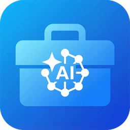

# AI Toolbox

<p align="center">
  
</p>

<p align="center">
  <strong>Personal AI Toolbox</strong> - All-in-one management for your AI coding assistant configurations
</p>

<p align="center">
  <strong>English</strong> | <a href="README.zh-CN.md">简体中文</a>
</p>

> **关于语言：** 根目录 README 以英文为主，是因为 AppImageHub 等应用目录要求仓库 README 使用英文，中文为主会导致收录失败。完整的中文文档见 [README.zh-CN.md](README.zh-CN.md)。

<p align="center">
  <a href="https://github.com/coulsontl/ai-toolbox/releases">
    
  </a>
  <a href="https://github.com/coulsontl/ai-toolbox/blob/main/LICENSE">
    
  </a>
  <a href="https://github.com/coulsontl/ai-toolbox/releases">
    
  </a>
</p>

---

## Introduction

AI Toolbox is a cross-platform desktop application that helps developers efficiently manage the configuration of AI coding assistants. It supports **Windows**, **macOS**, and **Linux**.

### Features

- **OpenCode configuration management** - Visually manage OpenCode providers and models, with quick enable/disable toggles from the list view
- **Oh My OpenAgent / Oh My OpenCode Slim plugin configuration** - Visually manage the configuration of the Oh My OpenAgent and Oh My OpenCode Slim plugins
- **Claude Code configuration management** - Switch Claude Code between official subscription and custom API providers in one click, with dynamic model list fetching, global prompts, and plugin management
- **Codex configuration management** - Manage OpenAI Codex CLI official accounts/custom channels, model mappings, global prompts, plugins, and session history
- **Grok CLI configuration management** - Manage Grok CLI providers, `config.toml` / `auth.json`, official accounts, global prompts, and plugins
- **Gemini CLI configuration management** - Manage Gemini CLI official accounts/custom channels, `.env` / `settings.json`, global prompts, and usage information
- **Kimi Code CLI configuration management** - Manage Kimi Code CLI providers, `config.toml` / `credentials` official accounts, global prompts, and plugins
- **OpenClaw configuration management** - Manage OpenClaw models, providers, config file paths, and session records
- **Pi configuration management** - Manage Pi CLI models, providers, extensions, prompts, and runtime configuration
- **Oh My Pi configuration management** - Manage the OMP runtime root, `models.yml` providers, `config.yml` settings, and subagents. Codex subscriptions support native OMP login, private Codex CLI `auth.json` import (up to 256 KiB), and manual account switching. The list includes native-login and imported accounts from the selected runtime directory only; switching enables the selected account without deleting other credentials. Each account supports manual queries for remaining 5-hour and weekly quota and reset times; Pro subscriptions have no 5-hour limit. Quota queries are read-only, do not refresh tokens, and leave unknown or failed results unknown. No automatic switching, balancing, failover, or background quota polling is added. Tokens stay in `agent.db`, never YAML or shared exports; import checks structure, not session validity. Existing OMP sessions may need restarting after a switch. Account writes require native auth schema 8 (verified with OMP 18.8.7), and reject broker, WSL/UNC, or profile/XDG redirection. Login and native model discovery require `omp login openai-codex` and `omp models --json`.
- **Claude Desktop configuration management** - Manage Claude Desktop 3P gateway profiles, with one-click gateway takeover
- **Hermes Agent configuration management** - Manage Hermes Agent's `config.yaml`, providers, default model, global prompts, and memory files
- **DeepSeek Harness configuration management** - Manage DeepSeek Harness (dsh) `settings.yaml` / `.credentials.yaml`, providers, default model, and global prompts
- **Local proxy gateway** - A unified local proxy endpoint with Claude Code / Claude Desktop / Codex / Grok / Kimi / Gemini CLI takeover, protocol conversion, failover, request logs, usage statistics, and model pricing management
- **Image workbench** - Manage image generation/editing channels, create image jobs, and keep history and generated assets
- **MCP server management** - Centrally manage MCP (Model Context Protocol) server configurations, with import/export, favorites, groups, and multi-tool sync
- **Skills management** - Manage a central Skills repository, install from Git repositories or local directories, enable/disable and sync per tool, plus custom tools and group management
- **Session management** - Browse, search, rename, import, export, and delete sessions for OpenCode / Claude Code / Codex / Grok / Gemini CLI / Kimi / OpenClaw / Pi / Oh My Pi / Claude Desktop / Hermes / DeepSeek Harness
- **WSL sync** - Sync the various CLI, MCP, and Skills configurations from Windows into a WSL environment, with automatic sync and custom mappings
- **SSH sync** - Sync local configurations, MCP, and Skills to remote SSH hosts, with connection management, path mappings, and manual sync
- **Provider management** - Unified management of multiple AI providers (OpenAI, Anthropic, custom proxies, etc.), with cross-coding-tool sharing and deep-link import
- **System tray** - Quickly toggle providers, models, prompts, MCP, and Skills for each module from the system tray, without opening the main window
- **Data backup** - Local backups, WebDAV cloud backups, GitHub/Gitee private repository backups, automatic backups, optional backup encryption (passwords stored in the local system credential store), custom backup items, image asset backups, and sensitive file filtering
- **Theme switching** - Light, dark, and follow-system themes
- **Internationalization** - Chinese and English interfaces
- **Automatic update check** - Checks for new versions on startup

## Screenshots

<p align="center">
  
  
  
  <br>
  <em>OpenCode and Oh My OpenAgent / Oh My OpenCode Slim plugin configuration management</em>
</p>

<p align="center">
  
  
  
  <br>
  <em>Claude Code / Codex / MCP server management</em>
</p>

<p align="center">
  
  
  
  <br>
  <em>Skills management / Settings page / WSL sync</em>
</p>

## Download and Installation

Head to the [Releases](https://github.com/coulsontl/ai-toolbox/releases) page and download the installer for your system:

| Platform | Installer |
|----------|-----------|
| Windows | `.msi` / `.exe` |
| macOS | `.dmg` |
| Linux | `.deb` / `.AppImage` |

On macOS you can also install, upgrade, and uninstall via Homebrew:

```bash
brew tap coulsontl/ai-toolbox https://github.com/coulsontl/ai-toolbox
brew install --cask coulsontl/ai-toolbox/ai-toolbox
sudo xattr -rd com.apple.quarantine /Applications/AI\ Toolbox.app

brew upgrade --cask coulsontl/ai-toolbox/ai-toolbox
brew uninstall --cask coulsontl/ai-toolbox/ai-toolbox
# Optional: remove this tap once you no longer need it
brew untap coulsontl/ai-toolbox
```

Notes:

- The Cask currently lives in this repository, so the first `brew tap` must include the repository URL.
- After a new version is released, `Casks/ai-toolbox.rb` in this repository is updated automatically by the release workflow, so `brew upgrade` picks up the new version.

On Windows you can also install, upgrade, and uninstall via [Scoop](https://scoop.sh/):

```bash
scoop bucket add ai-toolbox https://github.com/coulsontl/ai-toolbox
scoop install ai-toolbox/ai-toolbox

# Upgrade: refresh the bucket to get the new manifest first, then upgrade the app
scoop update
scoop update ai-toolbox
scoop uninstall ai-toolbox
# Optional: remove this bucket once you no longer need it
scoop bucket rm ai-toolbox
```

Notes:

- The bucket currently lives in this repository, so the first `scoop bucket add` must include the repository URL.
- After a new version is released, `bucket/ai-toolbox.json` in this repository is updated automatically by the release workflow, so `scoop update ai-toolbox` picks up the new version.
- In-app auto-update is unavailable when the app is installed through Scoop; use `scoop update ai-toolbox` to upgrade instead.

## Tech Stack

| Category | Technology |
|----------|------------|
| **Desktop framework** | Tauri 2.x |
| **Frontend** | React 19 + TypeScript 5 |
| **UI components** | Ant Design 6 |
| **State management** | Zustand |
| **Internationalization** | i18next (Chinese/English) |
| **Database** | SQLite + JSONB |
| **Build tool** | Vite 7 |
| **Package manager** | pnpm |

## Project Structure

```
ai-toolbox/
├── web/                          # Frontend source
│   ├── app/                      # Application layer (App, routing, providers)
│   ├── components/               # Shared components
│   │   └── layout/               # Layout components (MainLayout)
│   ├── features/                 # Feature modules (grouped by domain)
│   │   ├── daily/                # 【Daily】 module
│   │   │   └── notes/            # Notes (Markdown)
│   │   ├── coding/               # 【Coding】 module
│   │   │   ├── opencode/         # OpenCode configuration (incl. Oh My OpenAgent / Oh My OpenCode Slim)
│   │   │   ├── claudecode/       # Claude Code configuration
│   │   │   ├── codex/            # Codex configuration
│   │   │   ├── grok/             # Grok CLI configuration
│   │   │   ├── geminicli/        # Gemini CLI configuration
│   │   │   ├── kimi/             # Kimi Code CLI configuration
│   │   │   ├── openclaw/         # OpenClaw configuration
│   │   │   ├── pi/               # Pi configuration
│   │   │   ├── oh_my_pi/         # Oh My Pi configuration
│   │   │   ├── claudedesktop/    # Claude Desktop configuration
│   │   │   ├── hermes/           # Hermes Agent configuration
│   │   │   ├── dsh/              # DeepSeek Harness configuration
│   │   │   ├── mcp/              # MCP server management
│   │   │   ├── skills/           # Skills management
│   │   │   ├── gateway/          # Local proxy gateway
│   │   │   ├── image/            # Image workbench
│   │   │   └── shared/           # Shared capabilities (providers, prompts, sessions, ...)
│   │   ├── shared/               # Capabilities shared across modules
│   │   │   └── deepLink/         # aitoolbox:// deep-link import and sharing
│   │   └── settings/             # 【Settings】 module
│   ├── stores/                   # Global state (Zustand)
│   ├── services/                 # API service layer
│   ├── i18n/                     # Internationalization configuration
│   ├── constants/                # Constants (module configuration)
│   ├── hooks/                    # Global hooks
│   ├── types/                    # Global type definitions
│   └── utils/                    # Utility functions
├── tauri/                        # Tauri backend (Rust)
│   ├── src/
│   │   ├── main.rs               # Entry point
│   │   ├── lib.rs                # Library entry point, command registration
│   │   └── coding/               # Coding module
│   │       ├── claude_code/      # Claude Code backend
│   │       ├── codex/            # Codex backend
│   │       ├── open_code/        # OpenCode backend
│   │       ├── grok/             # Grok CLI backend
│   │       ├── gemini_cli/       # Gemini CLI backend
│   │       ├── kimi/             # Kimi Code CLI backend
│   │       ├── open_claw/        # OpenClaw backend
│   │       ├── pi/               # Pi backend
│   │       ├── oh_my_pi/         # Oh My Pi backend
│   │       ├── claude_desktop/   # Claude Desktop 3P configuration backend
│   │       ├── hermes/           # Hermes Agent backend
│   │       ├── dsh/              # DeepSeek Harness backend
│   │       ├── oh_my_openagent/  # Oh My OpenAgent backend
│   │       ├── oh_my_opencode_slim/ # Oh My OpenCode Slim backend
│   │       ├── mcp/              # MCP server backend
│   │       ├── skills/           # Skills backend
│   │       ├── tools/            # Shared tool adapters and detection
│   │       ├── proxy_gateway/    # Local proxy gateway backend
│   │       ├── image/            # Image jobs and assets backend
│   │       ├── session_manager/  # Session management backend
│   │       ├── deeplink/         # Deep-link parsing and import
│   │       ├── auth_refresh/     # Shared OAuth scheduling for official accounts
│   │       ├── ssh/              # SSH sync backend
│   │       └── wsl/              # WSL sync backend
│   ├── Cargo.toml                # Rust dependencies
│   └── tauri.conf.json           # Tauri configuration
├── package.json                  # Frontend dependencies
├── vite.config.ts                # Vite configuration
└── tsconfig.json                 # TypeScript configuration
```

## Development Guide

### Prerequisites

- Node.js 20.19+ or 22.12+
- pnpm 9+
- Rust 1.90+
- See the [Tauri prerequisites](https://tauri.app/start/prerequisites/)

### Install dependencies

```bash
pnpm install
```

### Start the development server

```bash
pnpm tauri dev
```

### Build for production

```bash
pnpm tauri build
```

### Linting and checks

```bash
# TypeScript type checking
pnpm tsc --noEmit

# Rust checks
cd tauri && cargo check
```

## Feature Modules

| Module | Submodule | Status | Description |
|--------|-----------|--------|-------------|
| Coding | OpenCode | ✅ Done | OpenCode provider/model configuration, including Oh My OpenAgent / Oh My OpenCode Slim plugin configuration |
| Coding | Claude Code | ✅ Done | Claude Code official subscription/custom API configuration switching, with prompts, plugins, and session management |
| Coding | Codex | ✅ Done | OpenAI Codex CLI official account/custom channel management, with model mappings, prompts, plugins, and session management |
| Coding | Grok | ✅ Done | Grok CLI providers, `config.toml` / `auth.json`, official accounts, prompts, plugins, and session management |
| Coding | Gemini CLI | ✅ Done | Gemini CLI official accounts/custom channels, prompts, usage, and session management |
| Coding | Kimi | ✅ Done | Kimi Code CLI providers, `config.toml` / `credentials` official accounts, prompts, plugins, MCP/Skills, and session management |
| Coding | OpenClaw | ✅ Done | OpenClaw models, providers, configuration files, and session management |
| Coding | Pi | ✅ Done | Pi CLI models, providers, extensions, prompts, and session management |
| Coding | Oh My Pi | ✅ Done | Oh My Pi (OMP) runtime root, `models.yml` providers, `config.yml` settings, subagent configuration, and session management |
| Coding | Claude Desktop | ✅ Done | Claude Desktop 3P gateway profile configuration, with gateway takeover and session management |
| Coding | Hermes | ✅ Done | Hermes Agent `config.yaml`, providers, default model, global prompts, memory, and session management |
| Coding | DeepSeek Harness | ✅ Done | DeepSeek Harness (dsh) `settings.yaml` / `.credentials.yaml`, providers, default model, global prompts, and session management |
| Coding | Gateway | ✅ Done | Local proxy gateway, CLI takeover, protocol conversion, failover, request logs, and usage statistics |
| Coding | Image | ✅ Done | Image generation/editing channels, job history, and asset management |
| Coding | MCP servers | ✅ Done | MCP server configuration management, with import/export, favorites, groups, and tool sync |
| Coding | Skills | ✅ Done | Central Skills repository management, with Git/local installation, custom tools, and multi-tool sync |
| Coding | Session management | ✅ Done | Browse, search, rename, import, export, and delete sessions across tools |
| Settings | WSL sync | ✅ Done | Sync CLI, MCP, and Skills configurations into a WSL environment |
| Settings | SSH sync | ✅ Done | Sync CLI, MCP, and Skills configurations to remote SSH hosts |
| Settings | General | ✅ Done | Language switching, theme switching, startup items, proxy, visible modules, and version update checks |
| Settings | Backup | ✅ Done | Local/WebDAV backup and restore, automatic backups, custom backup items, and file filtering |
| Settings | S3 | ✅ Done | S3-compatible storage configuration |
| Settings | Providers | ✅ Done | Unified AI provider management |
| Daily | Notes | 🚧 In progress | Markdown note management and search |

## Data Storage

SQLite is the local primary database, with per-module configuration stored in JSONB tables. A small number of structured tables (gateway request logs, daily usage rollups, model pricing) use regular columns instead, which keeps aggregation queries and indexes efficient.

### Design Principles

- **Local-first**: All data is stored locally to protect privacy
- **Service-layer API**: The frontend talks to the backend through the service layer and does not use localStorage directly
- **Flexible backup**: Local ZIP, WebDAV cloud backup, automatic backup, custom backup items, and external configuration file backups

### Tables

| Table | Description |
|-------|-------------|
| `settings` | Application settings |
| `app_migration` | Internal application migration records |
| `opencode_common_config` | OpenCode common configuration |
| `opencode_prompt_config` | OpenCode prompt configuration |
| `opencode_favorite_provider` | OpenCode favorite providers |
| `opencode_favorite_plugin` | OpenCode favorite plugins |
| `claude_provider` | Claude Code provider configuration |
| `claude_common_config` | Claude Code common configuration |
| `claude_prompt_config` | Claude Code prompt configuration |
| `codex_provider` | Codex provider configuration |
| `codex_common_config` | Codex common configuration |
| `codex_prompt_config` | Codex prompt configuration |
| `codex_official_account` | Codex official account configuration |
| `codex_plugin_workspace_roots` | Codex plugin workspace roots |
| `grok_provider` | Grok CLI provider configuration |
| `grok_official_account` | Grok CLI official account configuration |
| `grok_common_config` | Grok CLI common configuration |
| `grok_prompt_config` | Grok CLI prompt configuration |
| `kimi_provider` | Kimi Code CLI provider configuration |
| `kimi_official_account` | Kimi Code CLI official account configuration |
| `kimi_common_config` | Kimi Code CLI common configuration |
| `kimi_prompt_config` | Kimi Code CLI prompt configuration |
| `gemini_cli_provider` | Gemini CLI provider configuration |
| `gemini_cli_common_config` | Gemini CLI common configuration |
| `gemini_cli_prompt_config` | Gemini CLI prompt configuration |
| `gemini_cli_official_account` | Gemini CLI official account configuration |
| `claude_desktop_provider` | Claude Desktop provider configuration |
| `claude_desktop_prompt_config` | Claude Desktop prompt configuration |
| `hermes_settings_config` | Hermes Agent settings configuration |
| `hermes_prompt_config` | Hermes Agent prompt configuration |
| `dsh_settings_config` | DeepSeek Harness settings configuration |
| `dsh_prompt_config` | DeepSeek Harness prompt configuration |
| `oh_my_pi_settings_config` | Oh My Pi settings configuration |
| `oh_my_pi_prompt_config` | Oh My Pi prompt configuration |
| `oh_my_pi_agents_config` | Oh My Pi centralized subagent configuration |
| `pi_settings_config` | Pi settings configuration |
| `pi_prompt_config` | Pi prompt configuration |
| `openclaw_common_config` | OpenClaw common configuration |
| `oh_my_openagent_config` | Oh My OpenAgent configuration |
| `oh_my_openagent_global_config` | Oh My OpenAgent global configuration |
| `oh_my_opencode_slim_config` | Oh My OpenCode Slim configuration |
| `oh_my_opencode_slim_global_config` | Oh My OpenCode Slim global configuration |
| `mcp_server` | MCP server configuration |
| `mcp_preferences` | MCP server preferences |
| `favorite_mcp` | MCP favorites |
| `mcp_group` | MCP groups |
| `skill` | Skills records |
| `skill_group` | Skills groups |
| `skill_repo` | Skills Git repository sources |
| `skill_preferences` | Skills preferences |
| `skill_settings` | Skills settings |
| `custom_tool` | Skills/MCP custom tool configuration |
| `wsl_sync_config` | WSL sync configuration |
| `wsl_file_mapping` | WSL file mappings |
| `ssh_sync_config` | SSH sync configuration |
| `ssh_connection` | SSH connection configuration |
| `ssh_file_mapping` | SSH file mappings |
| `proxy_gateway_settings` | Gateway settings |
| `gateway_session_usage_state` | Gateway session usage collection state |
| `image_channel` | Image channel configuration |
| `image_job` | Image job records |
| `image_asset` | Image asset records |

The following 3 tables use regular columns instead of JSONB:

| Table | Description |
|-------|-------------|
| `proxy_request_logs` | Gateway request log details (tokens, cost, latency) |
| `usage_daily_rollups` | Gateway usage statistics aggregated by day |
| `model_pricing` | Model pricing table |

## Contributing

Issues and pull requests are welcome!

1. Fork this repository
2. Create a feature branch (`git checkout -b feature/amazing-feature`)
3. Commit your changes (`git commit -m 'Add some amazing feature'`)
4. Push to the branch (`git push origin feature/amazing-feature`)
5. Open a pull request

## Recommended IDE Setup

- [VS Code](https://code.visualstudio.com/)
- [Tauri extension](https://marketplace.visualstudio.com/items?itemName=tauri-apps.tauri-vscode)
- [rust-analyzer](https://marketplace.visualstudio.com/items?itemName=rust-lang.rust-analyzer)

## License

[AGPL-3.0-or-later](LICENSE) © 2026 coulsontl

This program is free software: you can redistribute it and/or modify it under the terms of the [GNU Affero General Public License as published by the Free Software Foundation](LICENSE), either version 3 of the License, or (at your option) any later version.

This program is distributed in the hope that it will be useful, but WITHOUT ANY WARRANTY; without even the implied warranty of MERCHANTABILITY or FITNESS FOR A PARTICULAR PURPOSE. See the [LICENSE](LICENSE) for more details.

Because this project is licensed under AGPL-3.0, **users who interact with the program over a computer network are likewise entitled to receive its source code**. This repository is the complete corresponding source, and the source for each release corresponds to the same tag.

## Acknowledgments

- [skills-hub](https://github.com/qufei1993/skills-hub) — MIT
- [cc-switch](https://github.com/farion1231/cc-switch) — MIT
- [skills-manager](https://github.com/xingkongliang/skills-manager) — MIT
- [linux.do](https://linux.do)
- [axonhub](https://github.com/looplj/axonhub) — Apache-2.0 (its `llm/` directory is LGPL-3.0, see [NOTICE](NOTICE))
