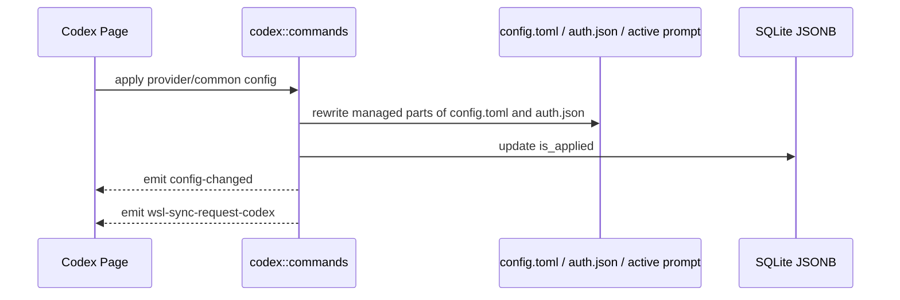

# Codex 后端模块说明

## 一句话职责

- `codex/` 负责 Codex provider/common config、`config.toml`、`auth.json`、prompt、plugin、官方账号与 memories 记忆文件相关运行时文件。

## Source of Truth

- Provider、common config、prompt config、official account 和 plugin workspace roots 的长期主数据在 SQLite JSONB；旧 SurrealDB 仅用于启动时一次性导入。

- 当前生效根目录优先级是：应用内 `root_dir` > 环境变量 `CODEX_HOME` > shell 配置 > 默认根目录。
- Codex 是“根目录模块”，`config.toml`、`auth.json`、prompt、`skills/` 都从当前根目录派生。历史同步目标由命令层解析 Codex history source：会话管理来源为 `all` 时默认本机优先，当前根目录是 WSL Direct 时只处理该 WSL root。
- prompt 的运行时事实源是当前根目录下的 Codex active global prompt 文件，而不是数据库记录本身。当前按 upstream 语义选择：非空 `AGENTS.override.md` 优先，否则使用非空 `AGENTS.md`；两者都为空时写入目标优先保持已存在的 `AGENTS.override.md`，否则使用 `AGENTS.md`。

## 核心设计决策（Why）

- `config.toml` 不能靠字符串拼接合并 common/provider 配置，必须结构化 merge，避免顶层键被吞进 provider 表作用域。
- common config 是供应商共享默认值，provider 显式配置必须在应用时覆盖 common。入库拆分只能删除与 common 值相同的重复项，不得仅因字段同名就删除不同值；尤其要保留 provider 自己的 `model`、`model_reasoning_effort` 和 provider table 字段。
- `auth.json` 与 `config.toml` 混有 Codex runtime 自有字段；AI Toolbox 只能改受管字段，不能整文件覆盖运行时状态。
- `apply_config_internal` 统一负责写文件、更新 `is_applied`、发 `config-changed` 和 `wsl-sync-request-codex`。
- Codex 官方订阅的模型下拉来源是共享模型目录，而不是 Codex 本地账号文件。远程目录不可用时使用内置兜底；账号 quota/plan 只影响可用性判断，不应阻断 provider 表单读取模型列表。
- 当 provider 表为空、当前 Codex root 没有 API key / base_url 这类三方本地配置，并且本地 `auth.json` 有有效官方登录态时，启动初始化和 provider 列表懒加载会自动创建持久化 official 默认 provider；新建 provider 必须使用新的 `codex_provider` id，不复用 official account 记录里的 `provider_id`。
- 启动初始化和 provider 列表懒加载必须使用同一套 official-only 判断；如果本地同时存在官方登录态和三方 `base_url` / API key 配置，应保留 `__local__` 临时 provider 语义，不要在启动阶段持久化默认 provider。
- `__local__` 临时 provider 只用于三方/自定义本地配置。不要把纯官方订阅本地运行态显示成 `default（来自本地）`，否则用户删除持久化官方订阅后会看到无法删除的官方订阅临时卡片。
- official account 命令必须区分 `provider_id == "__local__"` 和 `account_id == "__local__"`：前者是临时 provider，后端必须拒绝 OAuth/apply/delete/refresh/copy 等 official-account 管理入口；后者是在真实持久化 official provider 下展示本机运行时登录态的虚拟账号。
- 从页面粘贴导入的 `auth.json` 只保存为官方账号快照，不覆盖当前 live `auth.json`；只有用户显式应用该账号时才写入运行时文件。
- Official OAuth freshness: apply 路径已有 `ensure_fresh_official_runtime_auth`（lead 3 天）。启动 / 周期巡检由 `coding::auth_refresh` 调用 `refresh_applied_codex_accounts_if_needed`（所有已入库官方账号，排除 `__local__` 虚拟账号；默认 interval 12h）。未应用账号只把新 token 写回 SQLite；**仅 applied** 才写 live `auth.json`，写后须 `config-changed` + `wsl-sync-request-codex`（与 apply 对齐）。额度 `wham/usage` 不进该调度器。

## 关键流程

## 易错点与历史坑（Gotchas）

- Codex 无可委托的 `plugin marketplace add` CLI（不像 Grok/Claude 委托各自 CLI）。远程市场源（git 仓库 URL / GitHub `owner/repo` 简写 / `marketplace.json` 直链）由后端 `plugin_workspace::add_codex_plugin_workspace_root` 自行处理：git 源克隆到 `<codex_root>/.tmp/plugin-marketplaces/<id>`、JSON 源仅下载 `marketplace.json` 到该目录的 `.agents/plugins/`，再注册为 workspace root。LocalWindows 复用 `coding::skills::git_fetcher::clone_or_pull`（含代理 env + 超时）；WslDirect 走 `wsl -d <distro> --exec env <proxy> git clone` 到 Linux 路径、注册 UNC 等价路径。`marketplace.json` 直链仅下载单文件，插件可列但不可装（`source: { Local }` 相对路径无对应目录）。重复添加同一 URL 命中同一 `<id>` 缓存目录，触发 fetch+reset 刷新而非重建。删除 workspace root 时若路径位于受控缓存目录下，顺手清理克隆/下载的缓存。
- `extract_codex_common_config_from_current_file` 只能读当前根目录下的 `config.toml`，禁止复用 `read_codex_settings_from_disk`（会先读无关的 `auth.json`）。提取逻辑不需要 auth；WSL UNC / 网络路径上 `Path::exists` / `fs::read_to_string` 可能长时间阻塞，文件 I/O 必须走 `coding::file_io`（`spawn_blocking` + 超时），超时错误文案要带上实际路径。
- 不要对 `config.toml` 做纯文本拼接。遇到 table 合并必须走结构化 TOML merge。
- 改写 `config.toml` 时要显式保留 runtime-owned sections，例如 `mcp_servers`、`plugins`。`[features]` 不是整段保护；普通 feature key 可以由 provider/common config 管理，但 `features.plugins` 属于插件页/运行时开关，必须保留当前 live 文件里的值，不能被 provider/common config 覆盖。
- Codex 插件批量启用/禁用只作用于当前 runtime 下真实已安装插件。全启用会确保 `[features].plugins = true`；全禁用只把各插件 `enabled = false`，不要顺手关闭 plugins feature，否则会把“逐插件状态”和“全局插件功能开关”混成两个不可解释的状态。
- 改写 `auth.json` 时不要覆盖运行时 OAuth 字段；AI Toolbox 只应管理自己负责的 auth 键。
- 当 `codex_preserve_official_auth_on_switch=true` 且应用第三方 provider 时，第三方 API key 的运行时投影只能写入当前 `model_provider` 指向的 `[model_providers.<id>].experimental_bearer_token`，不能写顶层 `experimental_bearer_token`，因为 Codex runtime 不读取顶层 bearer token。缺少有效 `model_provider` 或对应 provider 表时应拒绝应用，避免跳过 `auth.json` 后生成无可用第三方凭据的运行态。provider 存储仍以 `settings_config.auth.OPENAI_API_KEY` 为主数据；保存/导入 live config 时要把 provider-scoped `experimental_bearer_token` 回填到 auth 并从存储 TOML 清掉，旧 managed 快照也必须包含这个生成字段，确保关闭开关或切回官方时不会残留。
- 改会影响 live 投影方式的设置（例如 `codex_preserve_official_auth_on_switch`）时，不能只写 SQLite：必须立刻重投影当前已应用渠道。统一走 `proxy_gateway::provider_switch::apply_or_switch_provider`——未接管则直接 apply；Gateway 已接管则 restore 直连 → apply → 再 engage single，原先是 failover 再开 failover。不要只 `save_settings`，也不要在前端拼 restore/engage。失败要回滚设置（对齐 `set_codex_unified_session_history`）。专用入口：`set_codex_preserve_official_auth_on_switch`。
- `requires_openai_auth` 与 provider-scoped `experimental_bearer_token` 是**无条件受管字段**，由投影完全托管（issue #394）：`project_codex_auth_to_runtime_config_with_mode` 永远写入或删除该字段，**没有「原样保留」分支**；`build_written_codex_config_toml` 在 merge 前会按 `next` 的 active provider id（回退 `current`）先清掉这两个字段。原因是镜像 diff（`remove_managed_toml_fields`）只删除 `previous_managed` 里存在的键，而 `set_codex_preserve_official_auth_on_switch` 用**新** flag 重新投影 previous——旧实现因此在 preserve false→true 翻转后把 `requires_openai_auth = true` 和 `experimental_bearer_token` 同时留在盘上，正是 cc-switch#7211 的 401。`previous` 的不变式准确表述是「必须包含上一次 apply 写下去的每个键」，不是「逐字节相同」。provider 级显式覆盖存 `settingsConfig.requiresOpenaiAuthMode`（`"keep"`/`"strip"`；**键缺失 = `auto`**，未知值丢弃回落 `auto`，snake_case 别名只读不写），只对 custom 生效（official 一律按 `auto` 归一化），优先级为 **official > 显式 mode > preserve > 自动规则**：`keep` **压过** `preserve`，两个字段会同时落盘（`experimental_bearer_token` 供凭据、`requires_openai_auth` 开账号能力），只有 `auto` 才看 preserve（preserve=true → 移除，保留 #353 的安全默认）。早先「preserve 一律 strip、控件置灰」的写法基于一个已被上游源码否证的前提：`provider_uses_first_party_auth_path`（`codex-rs/model-provider/src/provider.rs`）要求 `experimental_bearer_token.is_none()`，所以存在 bearer 令牌时 **不会**走 first-party 路径、凭据仍是中转 key，不存在「发错凭据 → 401」；反过来 `account_state()` 只要该字段为真就解析账号，正是 `/fast`、语音、image generation 这类账号能力（`has_chatgpt_account` / `features.enabled(FastMode)`）的开关。cc-switch#7211 的 401 只属于「无 bearer/env 且不该读 auth.json」的形状，别把它推广成无条件结论。UI 因此在 preserve 开启时**不置灰**，只把提示文案换成 warning 说明（`requiresOpenaiAuthPreserveHint`）。`keep` 必须**主动写入**：该字段此前只靠前端注入存在，而 #353 的用户手工删过这一行，「不剥离」在缺该行时是静默 no-op；无法定位 active provider 表时 `keep` 是 no-op + `log::warn!`，**不拒绝**（官方 provider 的存储 config 常无 `model_provider`，拒绝会把本来能用的 apply 变成硬失败）。前端不得再默认注入该行（`useCodexConfigState` 的默认模板、`codexConfigUtils` 的 `ensureCodexCustomProviderConfig` 与字符串兜底、`CodexPage` 的 All API Hub 导入模板均已移除），`extract_provider_settings_for_storage` 也会从 provider TOML 里清掉它；`__local__` 收编（`load_local_codex_provider_snapshot`）会把 live 的同名字段转成显式 mode，避免手工调好的鉴权意图丢失。**Gateway 接管优先**：`cli_proxy` 的 `patch_codex_config` 在接管时主动写 `requires_openai_auth = true`（因为 `patch_codex_auth` 把 `GATEWAY_API_KEY` 写进 auth.json，Codex 必须读它），mode 是 direct-connect-only 旋钮，**禁止**让接管路径去查它。回归测试：`cargo test --lib requires_openai_auth`。
- WSL 自动同步是事件驱动，不是“数据库写成功就等于已经同步到 WSL”。
- 删除 prompt 配置只删 SQLite 记录，不改写/清空当前 active prompt 文件。产品语义是“删除已保存的提示词记录”，不是“清空本地 runtime 提示词”；Claude Code / OpenCode / Grok / Gemini / Pi 统一此规则。若用户要改本地生效内容，应通过编辑/应用其他 prompt 或直接改 active prompt 文件。
- Codex prompt 同步必须按一组文件镜像：`AGENTS.md` 与 `AGENTS.override.md` 存在就同步，不存在就清理远端同名文件。不能只同步 active 文件，否则从 override 切回默认时远端会继续读取旧 override。
- 禁用已应用 prompt 必须清空当前 root 下两种已存在的 prompt 文件，再清除 DB applied 标记并发同步事件，保留数据库内容和已有文件名供重新应用；只清空 active override 会让旧 `AGENTS.md` 按上游回退规则重新生效。
- 普通“新建 provider”和“复制已应用 provider”都属于创建新记录，默认不应自动应用；不要因为源 provider 当前已应用，就把新记录写成 `is_applied = true`。
- `save_codex_local_config` 里的 `__local__` 不是普通新增 provider，而是把当前生效的本地运行时配置正式收编入库；在这个产品语义下，它保持 `is_applied = true` 是合理的，不要把这条链路误修成“保存但取消应用”。
- `save_codex_local_config` 收编 `__local__` 时仍要保留 provider `meta`，包括 Gateway 计费配置里的 `costMultiplier` / `pricingModelSource`；不要只保存 settings/common 而把表单提交的 meta 丢成 `None`。
- `adapter::to_db_value_provider` 是 Codex provider 持久化的最后一道写库入口；新增或调整 provider 级扩展字段时必须确认它也写入 JSONB。尤其 Gateway 计费 `meta` 不能只在 command 层结构体里保留，否则页面保存后重新 list 会丢失。
- 官方账号额度来自 Codex usage windows，后端负责按窗口语义解析并持久化 `5h`、weekly、monthly；前端只展示后端投影结果，不自行按套餐或字段顺序推断窗口类型。
- usage 响应里的 `rate_limit_reset_credits.available_count`（含 camelCase 别名）同样由后端解析并持久化为 `reset_credits_available`：字段缺失写 null，`0` 是有效值必须保留；只读展示不做重置次数明细接口和消耗操作。
- 拉取官方账号额度时必须带 `Chatgpt-Account-Id`，否则多账号/组织账号可能拿错 usage；解析 usage 时同时检查顶层 `rate_limit` 和 `additional_rate_limits`，monthly 这类窗口可能出现在 additional rate limits 中。
- 官方模型目录按 CLIProxyAPI 的 Codex plan 语义选择 `free/team/plus/pro` tier；未知 plan 默认按 `pro` 处理，并补入 Codex 内置模型 `gpt-image-2`。
- 当前官方模型目录只服务 AI Toolbox 页面下拉框，不等于 Codex runtime 的 `model_catalog_json`。自定义 Codex provider 可通过 `settingsConfig.modelCatalog.models` 保存简化模型映射；后端应用 provider 时会在当前 Codex root 下生成 `ai-toolbox-codex-model-catalog.json`，并在 `config.toml` 顶层写入相对文件名 `model_catalog_json = "ai-toolbox-codex-model-catalog.json"`。清空映射或切到官方 provider 时，只移除指向该 AI Toolbox 自有文件名的字段；不要覆盖或删除用户自有的外部 catalog 配置。
- 聚合接管对同一 catalog 文件有独占写权：`engage_aggregate_cli` 在覆盖前调用 `capture_codex_pre_aggregate_catalog` 把当时的 `model_catalog_json` 指针值与 `ai-toolbox-codex-model-catalog.json` 内容存进 `manifest.aggregate.pre_aggregate_catalog`；离开聚合（restore 直连 / 回落 single / engage 回滚）时由 `restore_codex_pre_aggregate_catalog` 精确还原：有原指针就写回原值，原本没有指针就只删除自家指针；有原文件内容就写回，原本没有文件就删除聚合新建的文件。老 manifest 缺该快照字段时才退回 `remove_codex_aggregate_catalog` 的「只删自家指针、保留文件」。已处于聚合态再 engage 必须复用第一份快照，不能重新采集，否则聚合目录会被当成原状冻结。
- `settingsConfig.config` 的默认 `model` 与 `settingsConfig.modelCatalog.models` 相互独立。后端只用 catalog 生成模型目录，不得用 catalog 第一项推断或改写默认 `model`。
- `settingsConfig.modelCatalog.models` 里的能力元数据必须和模型映射一起保存。`supportsImage=false`、`vision=false`、`attachment=false`、`modalities.input` 不含 `image` 会被 Gateway runtime 用来做发送前 text-only 图片替换；后端 storage normalize 不能只保留 `model/displayName/contextWindow`，否则真实 provider 保存后会丢失预测式图片兼容依据。
- 生成 `ai-toolbox-codex-model-catalog.json` 时，每条 entry 的 `context_window` / `max_context_window` 优先用显式填写的 `modelCatalog.models[].contextWindow`；未填则取 `config.toml` 顶层 `model_context_window`；再没有时用 `CODEX_DEFAULT_CONTEXT_WINDOW = 272_000` 兜底（对齐 `codex-rs/models-manager/models.json` 内置值），不能改回旧硬编码 128_000——否则会把 gpt-5 系列等模型的 `/status` 上下文错误压成 128k。未设 override 时不写该文件；Catalog entry 不存在这两个字段时 Codex 会按 `Option<i64> = None` 优雅降级（无硬上下文上限），但本项目的选择是写出 272_000 让 Codex 显式生效。**DeepSeek 官方 mirror 例外**：当 `config.toml` 的 `wire_api`/`api_format` 解析为 `responses`（native `/responses`）且 `base_url` 的 URL host 命中 `deepseek.com`（精确或 `.deepseek.com` 子域）时，整条兜底链被绕过——生成的 catalog 镜像内置的 `tauri/resources/codex_deepseek_catalog_template.json`（DeepSeek 官方 one-click 脚本 v1.3.0 的 models.json：freeform `apply_patch`、GPT-5 harness、1m context；官方 slug 为 `deepseek-flash`——2026-09 从 `deepseek-v4-flash` 更名并开放图片输入，声明 `text`+`image`——与 `deepseek-v4-pro`（text-only））。官方目录更新时必须重新从官方脚本（`cdn.deepseek.com/api-docs/codex-deepseek-setup-en.sh` 内嵌 heredoc）提取完整快照替换模板，不能手改个别字段。抓取后必须确认 `supports_search_tool` 为 `false`：DeepSeek Responses API 没有 `tool_search`，置 `true` 会让 Codex 把 MCP 工具藏在 tool_search 之后而永远调不到（cc-switch `5a040348` / #6647）；neutral 模板的 `true` 是有意设计（跨协议目标由网关展平 namespace 工具），不要顺手改成 `false`。此时未显式填写的 `contextWindow` 保留官方 1m（`1_048_576`），`displayName` 未显式填写时保留官方显示名；`spec.display_name` / `spec.context_window` 以 `Option` 承载"用户是否显式填写"，以区分官方值与默认兜底。wire_api/base_url 的解析必须复用 `provider_protocol::codex_wire_api_from_config` / `codex_base_url_from_config`（含 active 表 → 根级 → 首 provider 表的回退链），禁止在本模块另写一套更窄的 TOML 解析，否则 catalog 判定会与 Gateway runtime 的 native Responses 判定分叉。host 判定必须按解析出的 URL host 精确匹配，不能 `contains("deepseek.com")` 子串匹配（避免 `deepseek.com.evil.example` 之类误授官方能力）。非 `deepseek.com` host 或非 Responses target（chat/anthropic）仍走 neutral 模板。
- 生成 catalog entry 的 `input_modalities` 统一走 `codex_catalog_effective_input_modalities` 四步判定链（issue #368）：① 用户映射行 `modalities.input`（storage `modalities` 字段，camelCase only）显式声明最高，也是唯一能强制 text-only 的入口；未知值在生成期被丢弃（`CODEX_CATALOG_INPUT_MODALITIES` 白名单），防止一个 typo 让 Codex serde 拒收整个 catalog 文件。② bundled preset（`coding::preset_models::input_modalities_for_model_id`，同样只读编译期 bundled 文件）声明含 `image` 时胜出，出口只保留 Codex `InputModality` 认识的值（`text`/`image`/`audio`），preset 里的 `video`/`pdf` 会被丢弃——否则 Codex 会因未知模态拒绝整份 catalog 并直接从配置加载阶段失败（issue #218 评论）。③ matched 官方 vendor 条目声明含 `image` 时同样胜出。②③ 的"任一来源声明 image 即放行"是有意为之：preset 查询与 vendor 模板同为编译期快照、时效性相同，任何线性优先级都会让滞后一方的 text-only 快照重新剥离用户图片（本 issue 根因）；误放行的代价是上游可见报错，误剥离是静默剥夺，宁可 fail open。④ preset 已知但 text-only 的 id（如 `deepseek-chat`，preset 充当 confirmed-text-only registry）保持 text-only；vendor 与 preset 都未知的 id fail open 到 `text`+`image`（对齐 Codex `default_input_modalities` 的缺省语义）。vendor mirror 路径下未匹配任何官方 slug 的 id 绝不继承旗舰条目的 `input_modalities`（display_name/description 同样不冒充旗舰名），只克隆工具配置（freeform `apply_patch` 等）。该判定链同时作用于 vendor mirror、neutral 模板与聚合目录（聚合 entry 经 `AggregateCatalogEntry.input_modalities` 透传）。 回归测试：`cargo test --lib modalities` 覆盖 `codex_catalog_drops_modalities_codex_cannot_deserialize` 与 `preset_video_modalities_are_dropped_from_the_generated_catalog`。
- 自定义 provider 的 `settingsConfig.autoReviewModelOverride` 是 **provider 级单值**，不是模型映射行字段。应用时后端会把它统一写入 `ai-toolbox-codex-model-catalog.json` 中每条 entry 的 `auto_review_model_override`（默认全量，不提供“仅当前”选项）。仅当用户显式填写非空值时写入；不要默认填自身。Codex 只读当前会话 model 的 catalog 元数据，因此有 override 时还必须保证默认 `model` 在 catalog 中：无 mapping 则种子一条；有 mapping 但默认 model 缺失则自动补一条。官方 provider 不保存/不投影该字段。
- 聚合模式的模型目录（`aggregate_site_model_specs` → `codex_aggregate_catalog_entries` → `write_codex_aggregate_catalog`）里，每个站点贡献的模型必须等同于该站点在单站点模式下的 catalog：`codex_catalog_model_specs` 的映射行，**再加**该站点 `config` 顶层的默认 `model`。默认模型是**无条件补**的，不依赖 `autoReviewModelOverride`——否则没配 override 的站点在聚合列表里看不到自己的默认模型，而单站点模式却会把它原样发给上游（用户报的「渠道本身的模型没展示」就是这条漂移）。聚合 entry 的 `auto_review_model_override` 保持 `None`：它保存的是裸上游模型名，聚合模式只能用 `<site><sep><model>` 寻址。改任一侧的模型来源时都要同步检查另一侧。
- catalog entry 的 `display_name`（`description` 同值）回退链固定为：映射行显式 `displayName` → 预设模型名称（`coding::preset_models::display_name_for_model_id`，只读编译期 bundled `preset_models.json`，不读 app data 缓存）→ 原始 model id。聚合目录用同一 helper 拼 `<站点标签> · <显示名>`。所以只有 id 的模型（provider 自己的默认模型、没写显示名的映射行）在 Codex UI 里显示 “GPT-6 Astra” 而不是 `gpt-6-astra`；把显示名改回裸 id、或改成读 app data/远端缓存，都会让 catalog 生成变得不确定。改显示名来源时必须同时覆盖单站点与聚合两条路径。
- Per-model service (speed) tiers: `settingsConfig.modelCatalog.models[].serviceTiers` stores bare canonical tier ids (`"priority"` = Fast, `"ultrafast"` = Ultrafast). Only these two ids are recognized; unknown values are dropped at catalog-generation time so a typo can never produce a tier Codex would reject. The catalog generator expands each id to a full `{ id, name, description }` object via `CODEX_SERVICE_TIER_ENTRIES` (mirrors `codex-rs/models-manager/models.json` verbatim — verified against the official `gpt-5.6-sol` entry). When the spec declares tiers they replace the entry's `service_tiers`; when omitted the neutral template writes an empty array `[]` (no tier advertised — the safe default, matching cc-switch, so a third-party provider never falsely claims a priority tier it does not honor). The official DeepSeek vendor mirror path only writes `service_tiers` when the user explicitly opts in; otherwise the vendor entry is kept verbatim (DeepSeek entries carry no `service_tiers` array, so codex sees no fast mode unless the user opts in). No `default_service_tier` field is written — the official catalog also leaves it `None` on every model, so fast mode never auto-enables; the user must opt in. Do NOT add `"flex"` to the tier whitelist: Codex's `ServiceTier` enum defines `Flex` (request value `"flex"`), but zero official models declare it in their `service_tiers`, so advertising it would let users select a tier the upstream catalog never grants. Legacy `additional_speed_tiers` is deprecated upstream and intentionally not written. Storage normalize preserves `serviceTiers` (camelCase only, DB is the SSOT); non-empty arrays only, so storage stays compact and round-trips cleanly. Runtime chain when debugging "fast mode not working": catalog `service_tiers[].id` declaration → Codex `Feature::FastMode` enabled → user-side tier selection (config.toml top-level `service_tier` or the TUI fast-mode toggle) → `service_tier_for_request` filters against the declared ids → the selected string is passed verbatim into the Responses API `service_tier` param; a catalog declaration alone is necessary but not sufficient.
- Generated catalog `shell_type` must be `unified_exec`, never the legacy `shell_command`. Codex #39757/#39772 (2026-08-20, "Standardize shell execution on unified exec") removed the standalone `shell_command` runtime and demoted the value (plus `default`/`local`) to serde aliases of `ConfigShellToolType::UnifiedExec`; the only other variant is `Disabled`. The official models.json migrated all selectable models to `unified_exec` (only the internal `gpt-daybreak-blue/red-latest` experiment entries still declare `shell_command`), so both the neutral template (`codex_model_catalog_entry`) and the defensive backfill (`fill_template_fields_from_static`) write `unified_exec`. Exception: `tauri/resources/codex_deepseek_catalog_template.json` entries keep the `shell_command` they ship with — that file mirrors DeepSeek's officially published models.json verbatim, and both old and new CLIs parse the value (new CLIs treat it as the alias, identical behavior). Do not expose per-model `shell_type` UI: the legacy value has no independent semantics anymore and `Disabled` (no shell tool registered) is not a real third-party-provider use case. Source: issue #305 user confusion caused by the outdated `shell_command` value.
- Codex 历史同步会直接修改选定 history source 下的 runtime 私有状态：`state_5.sqlite`、`session_index.jsonl` 和 `sessions/**/rollout-*.jsonl` 首行 metadata。必须先备份，默认只修复 provider 路由，不改写 `model` 或 `cwd`，恢复最新备份前必须再创建 `pre-restore` 安全备份。`all` 这种列表来源不能被解释成同时同步本机和 WSL；写操作必须先解析成单一 Codex root。
- 历史同步读写 `state_5.sqlite` 时必须带 busy timeout，并对 `database is locked` / busy 做统一重试。`get_status` 打开弹窗就会读库，不能只在写路径重试；WSL/VS Code 远程场景下 Codex 持锁更常见。重试耗尽后的错误文案要可操作（结束当前回复/关闭 Codex 后再试），前端应对 locked 错误做本地化，不要直接抛原始 SQLite 字符串。
- 统一 Codex 会话历史只应让官方 provider 的 live `config.toml` 注入共享 `custom` history bucket，并保持 `auth.json` 官方登录态不变；注入段不能进入 provider 存储主数据。存量迁移只能按窄边界执行 `openai -> custom`，恢复只能按迁移账本把当初迁入的官方 session/thread 改回 `openai`，不能猜测开启期间新产生的 `custom` 会话来源。
- `read_codex_settings_from_disk` 读路径必须自愈悬空 `model_provider`：当顶层 `model_provider = "<id>"` 指向的 `[model_providers.<id>]` 表不存在时，就地删除该字段并落盘，`log::warn` 记录修复。入口是 `heal_dangling_codex_model_provider`。来源 issue #311：旧版网关接管（commit `43a8fd83` 之前）写入 `model_provider = "ai-toolbox-gateway"` + 对应表，升级或跨副本改写后表丢失但字段残留，Codex CLI 加载 config.toml 时硬性校验 `model_provider` 必须有对应表，否则报 `Model provider 'ai-toolbox-gateway' not found` 并拒绝启动对话。读路径是覆盖面最广的兜底，无论悬空态由手动编辑、部分迁移还是跨副本同步产生都能自愈；网关 `restore_codex_config` 只在主动恢复直连时清理 legacy sentinel，不能替代读路径自愈。自愈只删悬空字段让 Codex 回退默认 provider，不猜测/重建 provider 表（那需要 DB 里的 provider 信息，超出读路径职责）；空/不可解析的 config 不修复，原样返回让 Codex 自己报错；runtime-owned section（如 `mcp_servers`）必须原样保留。
- `read_codex_settings_from_disk` 同时返回模型目录预览（入口 `read_codex_catalog_preview`，返回 `content` + `pointer_active`）：config.toml 顶层 `model_catalog_json` 指针可用时读取该文件（相对指针按 config.toml 所在目录解析、绝对路径原样使用），`pointer_active=true`——跟随指针而不是写死 AI Toolbox 文件名，用户自配的外部 catalog 也能预览。指针不可用（缺失/为空/非字符串值/config 不可解析）时回退展示 AI Toolbox 目录文件（如有），`pointer_active=false`——清空映射、或只有老 manifest 退出聚合时指针被移除但文件保留，这个"遗留文件"状态恰恰是最需要诊断的（用户问"为什么模型列表没这些模型"）；带 `pre_aggregate_catalog` 快照的聚合退出会还原原指针与原文件内容，不再留下遗留文件。指针存在但文件缺失时 `pointer_active=true` 且 `content=None`，前端显示「文件不存在」空态。两者皆无时两个字段都是 `None`，前端不渲染该 tab。前端 tab 显隐条件是 `modelCatalog` 或 `modelCatalogActive` 任一存在；`modelCatalogActive=false` 时在编辑器上方显示「Codex 当前不会读取此文件」提示（10px tertiary）。catalog 读取失败只 `log::warn` 降级，不允许让整个预览失败。文件 I/O 走 `coding::file_io` 超时读取（Codex root 可能是 WSL UNC）。`CodexSettings` 是前端 wire 类型，必须保持 `#[serde(rename_all = "camelCase")]`：`auth`/`config` 都是单词字段，历史上缺 rename 不暴露；首次引入多词字段 `model_catalog` 时就因漏 rename 让前端静默读不到（前端读 camelCase `modelCatalog`），给该类型新增字段时优先检查序列化键名契约。
- memories 管理（`codex/memories.rs`，issue #296）是 `<codex_root>/memories/` 的通用文件浏览器：不同 Codex 版本的 memories 目录结构不同（`MEMORY.md`、`memory_summary.md`、`raw_memories.md`、`rollout_summaries/`、`skills/`、`extensions/ad_hoc/notes/`、`.git` 工作区），后端与 UI 都不能硬编码文件名白名单。
- memories 的 local/wsl 来源复用历史同步的 `resolve_codex_history_source_candidates`（为此已把该函数与 `CodexHistorySourceCandidate`/`CodexHistoryRuntimeSource` 放宽为 `pub(super)`）：当前 root 是 WSL Direct 时只有 WSL 来源；本机 root 时 WSL 来源要求 WSL sync 配置已启用且能解析 distro home。memories 不属于 WSL 自动同步与 `config-changed` 事件范围，面板直接经 UNC 读写所选来源，不发光同步事件。
- `list_codex_memories` 在请求的来源不存在时不报错：返回 `unavailable=true` + 完整 `availableSources` + 空列表，让前端能自动切换到可用来源（WSL-only 环境首次加载 `local` 必须能降级到 `wsl`，否则 UI 死锁在禁用态）。其余写操作对不可用来源直接报错，由 UI 禁用入口兜底。
- 来源存在但 `memories/` 尚未生成时，根目录列表返回空列表且不创建磁盘目录，保留 `availableSources`；只有缺失的子目录仍报错。新建文件必须经 `create_new` 原子创建，重名不得截断旧内容；编辑保存沿用覆盖语义。重命名的单文件名也必须拒绝冒号，避免 Windows 盘符相对路径逃出 memories root。
- 所有 memories 相对路径必须通过 scope 校验：拒绝 `..`、绝对路径/盘符/冒号、`.` 开头隐藏组件与 symlink 穿越（对齐 Codex 自身 `resolve_scoped_path` 语义）；盘符与分隔符要显式拒绝，否则非 Windows 平台会把 `C:\x` 当普通文件名放行。文件 I/O 必须在 `spawn_blocking` + 超时内执行，错误文案带实际路径并提示 WSL/网络路径排查方向。
- `clear_codex_memories` 对齐上游 `clear_memory_roots_contents`：清空 `memories/` 与 `memories_extensions/` 全部内容、保留目录本身、拒绝 symlink root；但刻意保留 `.git/` 等隐藏顶层条目，避免破坏 consolidation 基线导致 Codex 重建整个 workspace 历史。这是与上游 clear（连 `.git` 一起删）的有意偏差。
- memory 文件读取有 2 MiB 上限；`rollout_summaries/`、`raw_memories.md`、`MEMORY.md`、`memory_summary.md` 是 Codex 内部 DB/consolidation 的重建产物，手动删除后可能被重写——UI 有提示文案，后端不做 DB 级清理（私有 schema，跨版本不稳定）。

## 跨模块依赖

- 依赖 `runtime_location`：统一得到根目录、`config.toml`、`auth.json`、prompt、skills 路径与 WSL 目标路径。
- 被 `web/features/coding/codex/` 依赖：页面通过 `get_codex_root_path_info()` 和 provider/prompt API 管理状态。
- 被 `wsl/`、`ssh/`、`mcp/` 间接依赖：它们都受 `config.toml` 路径和保留段语义影响。

## 典型变更场景（按需）

- 改 `config.toml` 落盘逻辑时：
  同时检查结构化 merge、runtime-owned sections 保留、WSL 同步事件和最小回归测试。
- 改 root_dir 逻辑时：
  同时检查 `auth.json`、`config.toml`、active prompt、Skills 路径、历史同步目标和前端 path info 展示。
- 改会影响 live 投影的设置/开关时：
  写设置后必须重投影当前已应用渠道，统一复用 `apply_or_switch_provider`（直连直接 apply；Gateway 下 restore → apply → re-engage）。参考 `set_codex_preserve_official_auth_on_switch`。
- 改 provider 级鉴权投影（`requires_openai_auth` / `experimental_bearer_token`）时：
  同时检查 apply 与 previous-managed 清理两条投影路径、Gateway 接管路径和 `__local__` 收编；回归 `cargo test --lib requires_openai_auth`。改优先级或 preserve 交互时必须同期核对三种组合：preserve=false、preserve=true + `auto`（应移除）、preserve=true + `keep`（应两个字段都在）。

## 最小验证

- 至少验证：common/provider 合并后顶层键仍在根级，表结构未错位。
- 至少验证：编辑已应用配置后仍会发出 `wsl-sync-request-codex`。
- 至少验证：prompt 应用会改写当前根目录下的 active prompt 文件。
- 至少验证：存在非空 `AGENTS.override.md` 时，prompt 读取、应用、删除和 WSL/SSH 动态映射都作用于 `AGENTS.override.md`，且切回 `AGENTS.md` 时远端 stale override 会被清理。
- 改历史同步时，至少验证本机/WSL source 解析、新旧 `threads` schema、session 首行 metadata 往返、`session_index.jsonl` 重建、pre-sync 备份和恢复最新备份。
- 改统一会话历史时，至少验证 official config 注入/剥离、冲突 `custom` provider 跳过、`openai -> custom` 迁移、账本恢复和 Gateway 接管期间拒绝切换。
- 改 `codex_preserve_official_auth_on_switch` 时，至少验证：已应用第三方渠道下开关切换后 live `auth.json`/`config.toml` 立即按新投影更新；Gateway 接管时走 restore → apply → re-engage；失败时设置回滚。
- 改 `requires_openai_auth` 投影或 provider 级 mode 时，至少跑 `cargo test --lib requires_openai_auth`，并核对：keyless custom + `keep` 落盘出现该行、`strip` 移除、`auto` 回到 #353 行为；preserve=false→true 翻转后盘上**不残留**该字段与 `experimental_bearer_token`（除非 mode=`keep`，那时两个都应保留）；Gateway 接管期间该字段仍由 `patch_codex_config` 写入。注意该 filter 只匹配测试名，新增测试名必须含 `requires_openai_auth` 子串（或用 `cargo test --lib codex` 全量兜底）。
- 改 Codex 模型目录来源（单站点或聚合）时，至少跑 `cargo test --lib codex_model_catalog` 与 `cargo test --lib aggregate_catalog`，并核对同一 provider 在单站点目录与聚合目录里给出同一组模型（聚合条目只是多了站点前缀）。
- 改聚合 catalog 生命周期（engage 快照、离开聚合还原、`model_catalog_json` 指针）时，至少跑 `cargo test --lib pre_aggregate_catalog` 与 `cargo test --lib coding::proxy_gateway::cli_proxy::tests::`，并核对四条往返：接管前有 AI Toolbox 指针+单站点文件、有外部指针、无指针但文件残留、无指针无文件，退出聚合后都应回到接管前状态。
- 改 catalog 预览读路径时，至少跑 `cargo test --lib catalog_preview`，并检查预览弹窗三种 root 下的表现：有指针+文件存在（显示内容）、无指针+遗留 AI Toolbox 文件（显示内容+未激活提示）、无指针+无文件（tab 隐藏）；如可行再补指针悬空（显示「文件不存在」空态）。
