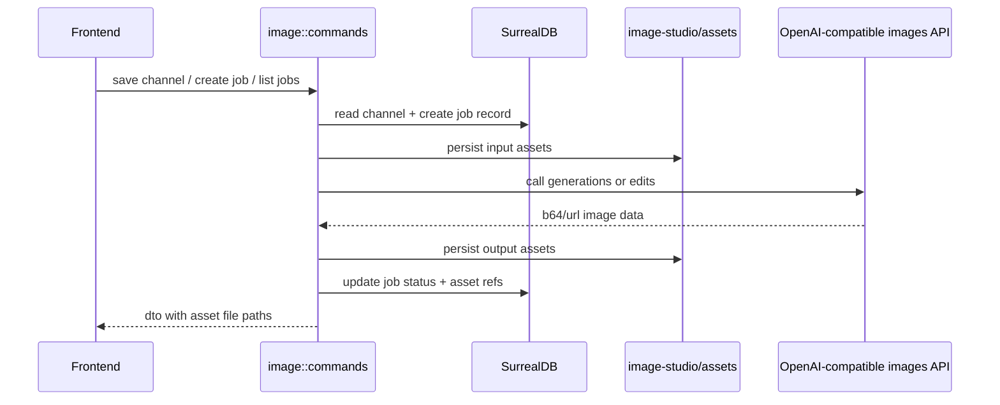

# Image 后端模块说明

## 一句话职责

- `tauri/src/coding/image/` 负责内置图片工作台的后端能力：渠道配置、图片任务持久化、图片 API 调用、资产文件落盘，以及前端 DTO 输出。

## Source of Truth

- 图片工作台的主数据分两层：SurrealDB 里的 `image_channel` / `image_job` / `image_asset` 元数据，以及 app data 下 `image-studio/assets/` 的真实图片文件；两者缺一不可。
- 前端表单、预览 data URL 和临时引用顺序都不是业务事实源；真正的任务记录由 `image_create_job` 写库后形成。
- 下载、历史、备份恢复消费的是落盘后的图片资产文件，不是接口响应的临时 base64。

## 核心设计决策（Why）

- 图片资产不直接整份写进数据库，而是文件落盘 + 元数据写库。这样历史规模增长后更可控，也更容易接入当前仓库的备份恢复链路。
- `Image` 不接入 `runtime_location`、WSL Direct、SSH 同步那套 4 个 coding 工具共享语义，因为它没有对应 CLI runtime 目录。
- 渠道配置单独落 `image_channel` 表，模型嵌在渠道记录里；工作台运行时选择由前端聚合后传 `channel_id + model_id`，后端再做最终校验。
- 当前只实现 OpenAI-compatible `images/generations` 和 `images/edits`，不要在现有代码路径里继续保留未接通的 provider 选项。
- 渠道创建统一走 `image_update_channel` 的“`id` 为空即创建”语义；不要再单独提供“先落一条默认空渠道记录”的命令，否则前端很容易实现出“点新增先写库、再弹编辑窗”的脏交互。

## 关键流程

## 易错点与历史坑（Gotchas）

- 不要再把图片接口配置保存成单个 `image_settings` 记录；当前真实配置源已经是 `image_channel` 表。
- 不要把 SurrealDB `type::string(id)` 返回的原样 record id 直接当成图片模块业务 id 使用。`image_channel` / `image_job` / `image_asset` 的 `id` 在 DTO 输出、更新查询、删除和排序前都应先清洗成干净 id，否则很容易出现“列表能看但编辑/删除/提交找不到记录”的假成功状态。
- 不要对 `image_asset` 继续使用 `SELECT *, type::string(id) as id FROM $asset_ids` 这类批量查询并直接反序列化成强类型列表。Surreal 在缺失记录场景下会把单个元素变成 `NONE`，从而触发 `NONE -> string` 的转换错误，连带把本来已经成功的图片任务 DTO 回填也炸掉。资产批量读取必须能容忍缺失记录。
- `image_asset` 的安全批量读取方式是：对具体表执行 `SELECT *, type::string(id) as id FROM image_asset WHERE id INSIDE $asset_ids`，其中 `$asset_ids` 绑定为 `Vec<surrealdb::sql::Thing>` 记录引用；然后在 Rust 侧按原始输入 `asset_ids` 顺序重排结果。不要假设数据库返回顺序会自动等于输入顺序，也不要指望数据库在重复 id 场景下返回重复行。
- 不要把 `gpt-image-2-2k` / `4k` 这类外部代理 alias 当成通用协议写死到核心数据模型里；当前只对齐标准 `gpt-image-2`。
- 参考图提交时不能把前端 data URL 原样落表；应先解 base64、写资产文件，再把资产 ID 关联到 job。
- `image_create_job` 不能只信前端自动选择结果；必须根据 `channel_id + model_id + mode` 再校验一次渠道启用状态、模型启用状态和模式能力。
- 同一个 `model_id` 允许存在于多个渠道，因此任务记录必须持久化 `channel_id`、`channel_name_snapshot`、`model_id`、`model_name_snapshot`，不要只存一个裸模型名。
- “自动选择第一个渠道”的语义依赖 `image_channel.sort_order`；排序是业务事实，不能依赖查询返回顺序或 JSON 内部顺序。
- 返回给前端用于 `` 展示的应该是文件路径，由前端再通过 `convertFileSrc` 转换；不要自造协议 URL。
- 只把文件路径回给前端还不够。图片页一旦依赖 `convertFileSrc(file_path)` 展示 app data 下的本地资产，必须同步确认 `tauri.conf.json -> app.security.assetProtocol` 已开启，并且 scope 覆盖 `image-studio/assets/**`；否则后端任务、数据库记录和本地文件都成功了，webview 仍会因为拿不到 asset 协议资源而表现成“页面没有图片”。
- 新增图片资产目录后，必须在同一任务里同步接入 backup / restore，否则会出现“历史任务还在、图片文件丢了”的分叉。
- 图片 API 报错不能只透传裸 HTTP 状态和上游 body；至少要带上 `mode`、`channel`、实际请求 `url`。否则像“image is not supported”这类上游转换错误，很难判断到底是文生图 path 配错，还是改图接口本身不支持图片输入。
- 对图片网关常见的瞬时上游失败（尤其 `504/503/502/408`）不要直接把第一次响应当最终结果。当前图片链路允许做小次数、短间隔自动重试；否则用户侧会看到“同一提示词有时成功、有时 60 秒后直接失败”的强随机体验。
- 仅有最终错误日志还不够定位图片链路问题。对图片请求至少要能从日志区分 4 个阶段：请求发起、响应头到达、响应体读完、JSON 解析完成；如果有 `data[].url` 二次拉取，还要再区分结果图请求的 headers/body 两段。否则像“服务端 46 秒完成、客户端 300 秒才失败”这类问题会长期混淆在一起。
- 图片链路的阶段性成功日志默认应降到 `debug`，不要长期保留成文件级 `info` 噪音；常驻日志重点保留 `warn/error`，尤其自动重试、上游 `5xx`、JSON 解析失败、结果图二次拉取失败和 DTO 构建失败。
- 如果要把图片请求快照落库用于历史排查，只能保存脱敏后的 headers 和可读的 body 摘要。不要把真实 `Authorization`、multipart 边界或图片二进制直接写进 `image_job`。
- 某些图片网关在 Windows 客户端上会出现“服务端已生成成功，但压缩响应在 50-60 秒附近被远端直接断开”的兼容问题；症状通常是服务端使用记录正常、`curl` 可成功，但 `reqwest` / Windows Python 在 `send()` 阶段报 `error sending request for url` 或 `RemoteDisconnected`。当前图片模块对这类渠道统一发送 `Accept-Encoding: identity`，并且图片请求单独走禁用自动解压的 HTTP client；这两层 workaround 不要轻易删掉。

## 跨模块依赖

- 依赖全局 `http_client` 读取代理设置并构建 HTTP client。
- 依赖根级 `lib.rs` 注册命令。
- 与 `settings/backup` 紧耦合：`image-studio/assets/` 必须进入备份恢复。

## 典型变更场景（按需）

- 扩新模型或新的请求语义时：
  先判断是否仍兼容当前 `ImageTaskParams`；如不兼容，应新增 capability 分支而不是偷改现有字段含义。
- 改渠道配置结构时：
  同时检查工作台聚合、任务提交校验、历史快照展示三处是否仍一致。
- 改资产存储路径时：
  同时检查 DTO 输出、下载、备份 zip、restore 输出路径和旧记录兼容。

## 最小验证

- 至少验证：保存渠道后重新读取仍一致，且 `sort_order` 顺序稳定。
- 至少验证：同一模型存在多个渠道时，任务提交会按传入 `channel_id` 正确路由。
- 至少验证：创建任务后，数据库记录和 `image-studio/assets/` 文件同时产生。
- 至少验证：从备份恢复后，历史任务引用的图片文件仍可从 app data 目录读取。
