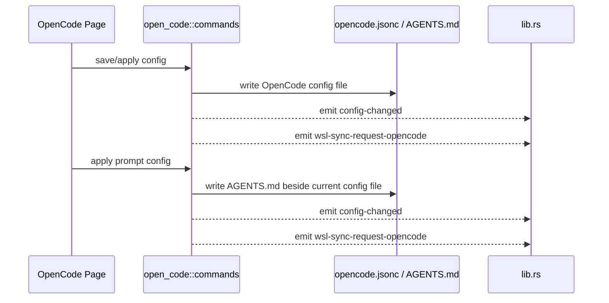

# OpenCode 后端模块说明

## 一句话职责

- `open_code/` 负责 OpenCode 配置文件、provider 数据、prompt 文件、模型读取和托盘联动。

## Source of Truth

- 当前生效配置文件路径的优先级是：应用内 `common_config.config_path` > 环境变量 `OPENCODE_CONFIG` > shell 配置 > 默认路径。
- `opencode_common_config` 和 `opencode_prompt_config` 的主存储是 SQLite JSONB；旧 SurrealDB 仅用于启动时一次性导入。
- OpenCode prompt 文件不是独立根目录配置，而是基于当前生效配置文件所在目录派生出的 `AGENTS.md`。
- OpenCode 主模型和小模型的运行时值都使用 `provider_id/model_id` 格式；不要把它降成裸 `model_id`。
- OpenCode Core 的 Agent 配置位于顶层单数 `agent`，Agent 独立模型同样使用完整 `provider_id/model_id`；插件 OMO/OMOS 使用的复数 `agents` 是另一份配置，不能混用。`small_model` 当前仍用于标题生成等轻量内部任务，并未被 `agent` 取代。
- OpenCode Core 还会从全局配置目录下的 `agent/**/*.md` 和 `agents/**/*.md` 读取 Markdown Agent。规范的新目录是复数 `agents/`，新建与默认 WSL/SSH 映射只使用复数目录；为避免老用户文件升级后消失，读取、编辑和删除仍兼容旧单数 `agent/`，并写回原始来源路径。应用内自定义 `OPENCODE_CONFIG` 文件只改变主 JSON 文件，不改变默认全局 Agent 目录；不能从自定义 JSON 的父目录猜测 Markdown Agent 目录。WSL Direct 时该目录必须从统一 runtime location 的 Linux 用户根解析。
- models.dev 的 `experimental.modes.*` 在 OpenCode 语义中会展开成虚拟模型，ID 形如 `${base_model_id}-${mode}`，例如 `gpt-5.5-fast`；后端统一模型列表需要透出 `base_model_id` / `experimental_mode`，供前端继承 base variants。
- `favorite provider` / `我使用过的供应商` 库不是当前配置镜像，而是独立的历史库和诊断缓存；真正的 OpenCode 运行时配置仍以当前配置文件内容为准。
- V1/V2 模式开关以当前配置路径旁的 `openvode_v1.<ext>` 备份是否存在作为状态源。开启时先解析完整 JSONC，再写 V2 临时文件并通过同目录重命名替换；关闭时把 V2 当前文件保存为 `opencode_v2.<ext>` 后恢复 V1 原文。路径扩展名沿用当前配置，备份重名时保留旧 V2 副本并加时间戳。

## 核心设计决策（Why）

- OpenCode 保存的是“配置文件路径”，不是配置根目录，因此 prompt、plugins、oh-my-openagent、skills 等路径都必须基于配置文件所在目录继续推导。
- `apply_config_internal` 负责统一写文件、发 `config-changed`、触发 WSL 同步事件，避免主窗口和托盘入口各自分叉。
- tray 的模型切换直接复用统一模型列表，并把选择结果按完整 `provider_id/model_id` 写回配置，避免托盘和主页面对模型 ID 语义不一致。
- prompt 配置既有数据库记录，也有当前生效的本地 `AGENTS.md` 文件；真正会影响运行时的是落到本地文件的内容。
- 文件式预览由 `get_opencode_preview` 返回原始 `opencode.json`/`opencode.jsonc` 与 `auth.json` 内容，前端按文件 Tab 展示。

## 关键流程

## 易错点与历史坑（Gotchas）

- 官方卡片分享只读取选中 provider 的 API-key 认证，不能复用会 fallback 到 OAuth access 的连通性 `resolve_auth_credential`。默认 URL/SDK/模型从本地 cache/bundled metadata 补齐；用户当前配置优先，分享不触发远端刷新。

- 不要把 OpenCode prompt 路径写死成 `~/.config/opencode/AGENTS.md`。应始终先走当前配置路径决议，再取同目录下的 `AGENTS.md`。
- 前端显示的 `configPathInfo.source` 只是“路径来自哪里”，不是 WSL Direct 判断。WSL Direct 统一看 `runtime_location` / `module_statuses`。
- 不要把 OpenCode 的模型值只当成 `model_id`。tray、统一模型列表和配置文件都约定使用 `provider_id/model_id`，少一段就会导致选中态和写回都失真。
- `provider_id/model_id` 只能按第一个 `/` 分隔；models.dev 里有些 model id 自身包含 `/`，例如 `zenmux/openai/gpt-5.5-fast` 的 provider 是 `zenmux`，model id 是 `openai/gpt-5.5-fast`。托盘和保存逻辑不能用 `split('/')` 后要求两段。
- 展开 `experimental.modes.*` 时要避免和真实 `${base_model_id}-${mode}` 模型重复；真实模型优先，虚拟模型跳过。
- tray 展示模型时会把当前已选模型保留在菜单里，即使其 provider 已被禁用；改 tray 过滤逻辑时不要把当前选择无提示隐藏掉。
- prompt tray 会过滤掉 `__local__` 临时项。页面仍可能把当前本地文件映射成 `__local__` 且视为已应用，因此页面与 tray 对“当前应用 prompt”的表达不一定完全对称。
- `favorite provider` 库的产品语义是“使用过的供应商历史库”，主要用于删除后找回和保留诊断信息；如果某个 provider 已不在当前配置里但仍留在库中，默认先视为预期语义，而不是脏数据。
- 改配置落盘后不要只刷新页面状态；托盘和 WSL 自动同步也依赖统一事件链路。
- `OpenCodeConfig.other` 是 `agent`、`default_agent` 和未来顶层字段的无损兼容边界。新增 Agent UI 时不要把后端类型收窄为不完整结构；读取 -> 写回必须保留 Agent 的 permission、options、Provider 私有字段和其他未知字段。
- JSON Agent 和 Markdown Agent 是两个独立 Source of Truth。页面可以按 OpenCode 加载顺序聚合展示，但编辑必须写回原来源；禁止把已有 Markdown Agent 静默复制或迁移进 `opencode.json`。Markdown 保存应保留正文与未知 Frontmatter 字段，并用内容 Hash 防止覆盖外部编辑。
- Markdown Agent 列表是 best-effort 聚合：单个不可读文件或目录遍历错误只记录 warning，不得让其他正常 Agent 全部消失。遍历 `agent/` / `agents/` 时不要跟随目录符号链接扩大读取边界。
- 共享 `fetch_provider_models` 的 Google Native 模型列表探测使用 Gemini API `models.list` 路径。传入的 Gemini base URL 如果不以 `v1` / `v1alpha` / `v1beta` 结尾，后端应只在探测时补 `/v1beta/models`；不要要求 Gemini CLI 的 `GOOGLE_GEMINI_BASE_URL` 持久化时必须包含版本路径。
- 共享 `fetch_provider_models` 的 OpenAI 兼容分支按 OpenAI `data[]` -> Google `models[].name` -> Codex catalog `models[].slug` 的顺序识别 schema，解析器是 `parse_generic_models_response`。智谱/GLM 的 Codex 原生 Responses 端点 `GET /api/v1/models` 与 Codex 官方 `models.json` 同形（`slug` + `display_name`），少这一支会让整个模型列表被 `Failed to parse models response. Response was: ...` 拒绝（issue #381）。`slug` 为空白时丢弃该行、`display_name` 缺失时回退 `slug`；三种 schema 都不匹配时仍保留原始响应文本。回归：`test_parse_codex_catalog_models_response`、`test_generic_models_response_keeps_openai_and_google_schemas`。
- 共享连通性请求的可选 `apiFormat=openai-codex-responses` 由 OMP 诊断显式传入，不从 URL 猜测。它使用 `/codex/responses`、Bearer 凭据、可选 JWT account id、`instructions`、`store=false` 和强制 SSE；不发送温度/输出上限。HTTP 200 仍须收到 `response.completed` 且没有错误终态才算成功。普通 OpenCode 诊断继续按 npm 选择既有协议。

- 模型 variants 的 option 拼写必须匹配 provider 的 npm 包：`@ai-sdk/openai-compatible` 只认 `reasoningEffort`，`thinkingConfig` 是 `@ai-sdk/google` 包专属。OpenCode 1.x 会把按包自动生成的 `reasoningEffort` variants 与配置 variants `mergeDeep` 合并，掩盖了写法错误；OpenCode 2.x 对配置 variants 原样使用，并在 openai-compatible 路径静默丢弃 `thinkingConfig`，导致思考度不随请求上行。`write_opencode_config_file` 里的 `normalize_openai_compatible_variants` 负责在落盘前把 openai-compatible 供应商下的 `thinkingConfig` 变体改写成 `reasoningEffort`，档位优先级是 `thinkingLevel`（已知档位 none/minimal/low/medium/high/xhigh/max，off/disabled→none，min→minimal）> 变体名（同样必须是已知档位）> `thinkingBudget`（0→none；正数按 1024/4096/10240/32768 映射 minimal/low/medium/high，更高为 xhigh）；三者都推导不出时保持该变体原样，绝不拿变体名硬凑出 `auto`/`no-thinking` 这类非法档位（Gemini 2.5 `auto` 的动态思考没有等价档位，`no-thinking` 靠 0→none 表达）；磁盘与 `sync_providers_from_config` 收藏快照共用 `sanitize_opencode_config`，保证两边写法一致；`@ai-sdk/google` 包保持原样，不要把该转换扩大到其他 npm。
- V2 模式下，磁盘格式与 `OpenCodeConfig` 内部 V1 编辑结构由 `v2_migration` 在读取/写入边界双向映射。**V1→V2 的事实源是 `../opencode/packages/core/src/v1/config/migrate.ts` 与 `packages/core/src/config/provider.ts`**：provider 用 `api: {type:"aisdk", package, url, settings}` + `request.headers/body`，model 用 `api.id` / `request` / `variants[].body` / `cost[]` / 完整 `capabilities`，agent 走 `agents`（`system`/`disabled`/`request.body`/`permissions`），MCP 走 `mcp.servers` 且 OAuth 嵌在 `oauth`、timeout 用 `{request}`；顶层还包含 `snapshot→snapshots`、`attachment→attachments`、`command→commands`、`skills` 数组、`reference→references`、`permission+tools→permissions`、`disabled/enabled_providers→experimental.policies`。不要退回 `model.modelID`、provider 顶层 `package/settings/headers/body` 或 `mcp.timeout.{catalog,execution}` 这些旧实现形状。V2→V1 只负责把编辑器要维护的 `providers/plugins/agents/mcp/disabled_providers` 还原为 V1 视图，未知 V2 字段保留在 `other` 原样回写。所有常规保存都必须检查同一配置路径的 V1 备份标记并转回 V2；不能因页面仍使用 V1 数据结构而把活动配置降回 V1。用户关闭模式时恢复备份文件原始字节内容。回归：`cargo test --lib coding::open_code::v2_migration`。
- 共享 `fetch_provider_models` / `test_provider_model_connectivity` 增加了可选 `configValueMode`：只有 Pi 调用方传 `"pi"`、OMP 调用方传 `"omp"` 时，后端才会在该工具自己的运行时环境里解析 `apiKey`/headers 的配置值语法；不传时所有值仍按字面量直传，不要把这个开关变成全局默认行为。两种模式的 host 选择（本机 / WSL Direct 发行版）共用 `tauri/src/coding/config_value_host.rs`，语法各自实现在 `tauri/src/coding/pi_config_value.rs`（`$ENV_VAR` 插值、`!command`、`$$`/`$!` 转义，解析失败即报错）与 `tauri/src/coding/omp_config_value.rs`（`!command` 或精确大小写环境变量名，否则字面量，解析不到即省略）。语义、失败语义与 WSL 边界见对应模块的 `AGENTS.md`（`pi/`、`oh_my_pi/`）。

## 跨模块依赖

- 依赖 `runtime_location`：决定 WSL 目标路径、prompt 路径和 Skills 目标目录。
- 依赖 `tray_support.rs`：主模型、小模型、prompt 和插件收藏的 tray 表达都从这里汇总。
- 被 `web/features/coding/opencode/` 依赖：页面会读取 `get_opencode_config_path_info()`、配置文件内容和 prompt 列表。
- 被 `wsl/`、`ssh/` 间接依赖：它们同步 OpenCode 时使用这里派生出来的路径语义。

## 典型变更场景（按需）

- 改配置路径逻辑时：
  同时检查 prompt 路径、plugins 路径、WSL 目标路径和设置页展示。
- 改 prompt 保存/应用逻辑时：
  同时检查 DB 记录、本地 `AGENTS.md`、`config-changed` 和 WSL 自动同步事件。
- 改 provider 导入、删除或诊断保存时：
  同时检查当前配置文件、favorite provider 历史库和页面/tray 展示三者是否仍符合各自语义。

## 最小验证

- 至少验证：自定义配置路径、环境变量路径、默认路径三种来源中至少两种。
- 至少验证：应用 prompt 后本地 `AGENTS.md` 被正确改写，并触发 WSL 同步事件。
- 至少验证：从 tray 切换主模型或小模型后，配置文件里仍是完整 `provider_id/model_id`，且页面/托盘选中态一致。
- 至少验证：包含 `agent.*.model`、permission、options 和未知字段的配置经过后端反序列化/序列化后保持不变。
