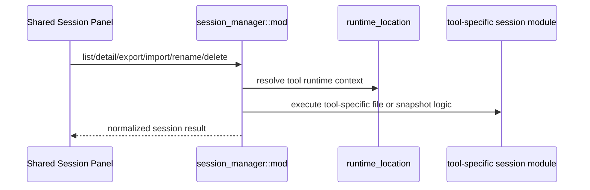

# Session Manager 后端模块说明

## 一句话职责

- `session_manager/` 负责四个内置工具会话的列表、详情、路径过滤、重命名、删除、导入和导出。

## Source of Truth

- 会话的真实来源不是数据库，而是各工具运行时目录或导出快照。Grok 使用 `<root>/sessions/<encoded-cwd>/<session-id>/summary.json + chat_history.jsonl` 目录结构。
- **唯一例外是 Codex 的选文件**：`<codex_home>/state_<N>.sqlite` 的 `threads.rollout_path` 被当作「哪个 rollout 文件代表这个 thread」的**选择提示**，用来定夺列表胜者与详情读取对象。它只是提示，不是事实源——DB 不可用（不存在/被 Codex 持有写锁/schema 漂移/`sqlite_home` 指向别处）时必须静默回退到文件系统启发式，不能隐藏磁盘上真实存在的会话；`threads` 之外的列一律不读，标题/摘要/项目目录仍由 rollout 文件解析。
- `source_path` 是会话操作的关键标识；对 OpenCode 这种特殊格式，还要经过专门的同源判断逻辑，不能简单字符串比较。
- dsh 的会话目录会**并存多个格式代际**产物（`session.jsonl` 是 v0，`session.v<N>.jsonl` 是第 N 代，各自可带 `.zstd`），迁移只新增文件不改写旧的，**数值最大的一代才是活跃产物**。发现时必须按目录选最高代，否则会显示旧快照、甚至整会话不可见；命名与代际规则唯一来源是 `crate::coding::dsh::session_artifact`，不要在 session_manager 里另写白名单。删除任一产物等于删除整个会话目录（所有代际一起消失），是正确语义。
- 当前工具的会话上下文路径必须先经 `runtime_location` 决议，再派生 sessions/projects/agents/data_root 等目录。

## 核心设计决策（Why）

- 四个工具共用一套 Session Manager 入口，但上下文解析各不相同，因此通过 `ToolSessionContext` 隔离各自文件布局。
- **会话身份是 `(runtime context, session_id)`，不是 `source_path`。** 多个 runtime 会把一个逻辑会话落成多个产物：Codex 每次 resume 新开一个 `rollout-<ts>-<thread id>.jsonl`（thread id 不变）、Gemini CLI 把一个会话摊在多个 `session-<ts>-<前8位>.jsonl` 上、pi/open-claw/Claude Code 的副本可能同时存在于两个 root 下。列表必须按会话身份收敛成一行（保留活跃时间最大的产物，即这些布局里的活跃产物），否则同一个 id 会以 N 行、N 个不同"最近活跃"出现（issue #357）。收敛只按 `source_path` 去重是错的：它恰恰收敛不了这种情况；`session_dedupe_key` 因此只是删除/导出批次的防线，不是列表语义。
- **Codex 的详情是「血缘」，不是「一个文件」。** `history_mode=paginated` 的 thread 会把前面轮次的记录留在**前缀 rollout** 里、用 `SessionMeta.history_base` 引用而不是复制（Codex 原话：祖先记录留在 `history_base` 后面），所以同一个 thread 的多个 rollout 不是超集关系，新的那个只是后缀。读取与搜索都必须按 `codex_rollout::resolve_lineage` 拿到的段由旧到新拼接，每段只读到子段记录的 `end_byte_offset` 为止、遇到 `session_meta` 就停（跳过祖先元数据）；只读客户端点名的那个文件会显示残缺会话。`legacy` 会话不跟链、仍是单文件读。链路任何一环不可信（缺前缀、cutoff 越界、成环）都退化成单段，绝不合并来路不明的记录。选文件同理走 DB 权威：`thread/revert` 后扫描**原理上**无法判断哪个 rollout 是活的（Codex 的 `thread_rollout_resolver` 明说 "a scan could find an older immutable rollout"），无 DB 时才回退到「活跃度最高、并列取更大 `source_path`」。
- 删除也走同一身份：删掉列表上那一行必须带走该会话的全部产物。
- 删除 Codex 会话前必须查外部引用：若别的 thread 把本次要删的某个 rollout 作为 `history_base`，删除会让对方回放断链，因此**拒绝删除**（对应 Codex 的 `ensure_no_external_references`）。批量删除里这是逐项失败（进 `failed_items`），不是整体失败。Codex 的 `delete_session` 会从 `sessions/` 根递归找出同 id 的全部 rollout 一起删（沿用 dsh"删任一产物 = 删整个会话"、Gemini CLI"同 id 文件一起清"的既有语义），否则删完一行，旧 rollout 会作为同一个会话再次出现。
- dsh 的 `select_generations`（按会话目录取最高代）与共享层按 id 收敛是两层互补：前者解决"一个目录多代"，后者解决"一个 id 多文件"，不要用其中一层去替代另一层。
- 读会话详情、删除、导出等重 I/O 操作统一放进 `spawn_blocking`，避免堵塞 Tauri async runtime。
- 导出使用统一 schema `ai-toolbox.session-export.v2`，同时保留 normalized messages 和 native snapshot，兼顾跨工具一致性与原生往返恢复。
- 会话详情页和导出里的消息展示统一消费 normalized `SessionMessage.blocks`。各工具 parser 负责把 raw runtime shape 转成 text/thinking/tool_call/tool_result 等 block；前端不应再按 Claude/Codex/Gemini/OpenCode 的原始 JSON 结构分叉展示。
- 会话详情右侧导航统一依赖 normalized `SessionMessage.id` 派生 DOM target。各工具 parser 读取详情时必须保证每条消息都有 id；运行时原始数据没有 id 时使用共享 helper 补 provider-scoped fallback id，不要让前端按工具类型或数组渲染位置分别猜定位规则。

## 关键流程

## 易错点与历史坑（Gotchas）

- 不要假设所有工具的会话根目录都是同一种布局。Codex 是 `sessions/`，Claude Code 是 `projects/`，OpenClaw 是配置目录旁的 `agents/`，OpenCode 还涉及 data/state/sqlite。
- 不要把"一个会话 = 一个文件"当成前提。`scan_sessions`/`scan_recent_sessions` 逐文件产出 `SessionMeta`，所以只要某个 runtime 一个 id 落多个文件，不收敛就会直接变成多行；判断重复时看 `session_id`，不要看文件路径或时间（时间本来就各不相同，那正是各产物的活跃时间）。
- `HistoryPosition.thread_id` 这个字段名是误导的：它装的是**前缀文件的 rollout id**，不是 thread id（Codex 自己的注释就说 "Treat its value as a `rollout_id`"）。对普通 rollout，thread id 与 rollout id 相同；`thread/revert` 之后的文件名形如 `rollout-<ts>-<threadId>_<rolloutId>.jsonl`——用**下划线**连接两个 id，不是第二个连字符。解析 rollout 文件名必须按这个语法，别用「取最后一个 uuid」之类的近似规则。
- Codex 的 DB 路径必须按 `state_<N>.sqlite` **族**匹配并取最大 N（当前是 `state_5.sqlite`），写死版本号会在 Codex 升库后静默失效。`config.toml` 的 `sqlite_home` / `CODEX_SQLITE_HOME` 优先于 codex home 本身，和 Codex 自己的 `SqliteConfig` 一致。
- 读 Codex DB 用短 busy timeout（500ms）**单次尝试**，不要套 `codex/history_sync.rs` 那套 40×250ms 重试：那是给用户主动发起的同步用的，会话列表每次刷新都会走，阻塞 10s 不可接受，而且我们本来就有文件系统回退，快速失败才是对的。
- 收敛时必须把"id 为空"的会话单独放行，不能把它们当成同一个身份合并；否则会把一批没有 id 的会话折叠成一行。
- 同一个 id 出现在不同 runtime context（local vs WSL/SSH）下不能合并，那是两个真实存在的会话；收敛 key 必须带上 context，而不是只带 id。
- 对 OpenCode，会话来源判断和导入导出依赖显式运行时环境与官方导出格式，不能套用其它工具的 JSONL 逻辑。
- OpenCode 会话读哪一代由「迁移到 V2」开关决定，不由库里有没有 `session_v2` 表决定。开关状态是当前配置路径旁是否存在 `openvode_v1.<ext>`（`open_code::v2_migration::is_active`）。开启后列表、详情、正文搜索、重命名和删除只碰 `session_v2` / `session_message`，并且只列出 `parent_id IS NULL` 的顶层会话；关闭后仍只读 V1 的 `session` / `message` / `part` 和 JSON storage。升级库两套表并存，不能因为表存在就自动切到 V2，也不能在一种模式下改另一套表。
- OpenCode CLI 版本可能在 official export 的 `info` 中自动补默认 `cost` / `tokens` 字段；往返测试应只归一化这类 CLI 默认补字段，不要把真实消息、路径或用户内容差异吞掉。
- 对 OpenCode 删除，不要为了确认 `source_path` 再先全量扫描会话缓存。`source_path` 自身就能解析出 `session_id` 并直接执行删除；预扫描只会把单删/批删放大成整库遍历。
- 对 OpenCode 删除，直删语义仍要保持幂等。若底层 SQLite/JSON 已不存在，应视为成功收敛，而不是把重复删除、并发删除或陈旧列表操作升级成 `Session not found`。
- 对 Gemini CLI，当前主格式是 `tmp/<project>/chats/session-*.jsonl` conversation record stream，不是单个 JSON 对象；旧版 `session-*.json` 仍要兼容。标题提取要优先使用 summary 或首条真实用户消息，并识别旧包装 prompt 里的 `[User Request]`，避免把 `[Assistant Rules - You MUST follow these instructions]` 当作会话标题。
- 对 Gemini CLI 删除，不能只删主 session 文件。必须同步清理同项目 temp 下的 `logs/session-<id>.jsonl`、`tool-outputs/session-<id>/`、`<id>/` session-scoped 目录，以及 `chats/<parentSessionId>/` subagent 目录和其 artifacts；但 artifacts 清理是 best-effort，主 session 文件删除不能被 artifact 权限、锁文件或残留目录阻断。
- Claude Code / Gemini CLI 的 SubAgent 文件会被主会话列表排除，但详情页需要通过父会话显式发现并进入子会话详情。不要放宽 `get_tool_session_detail` 让前端任意传文件路径直读；应先由 parent `source_path` 发现合法子会话，再用专用 subagent detail API 读取，保持 source_path 操作边界清晰。
- 对 Gemini CLI resume 命令，全局扫描会跨项目列出会话；如果能解析 `.project_root` 或 `projects.json`，命令必须体现需要在项目目录下执行，例如 `cd <projectRoot> && gemini --resume <id>`。
- 对所有可 resume 的 CLI，复制命令只有在能从工具自己的会话元数据解析出真实项目目录时，才加目录前缀。Codex 用 `cwd`，Claude Code 用 JSONL `cwd` 或 index `projectPath`，OpenCode 用 `directory`，Gemini CLI 用 `.project_root` 或 `projects.json`；不要用 sessions/projects/tmp/cache 这类运行时存储目录冒充项目目录。
- Grok 的项目目录取自 `summary.json.info.cwd`，resume 使用 `grok --resume <session-id>`；Session Manager 不读取 `session_search.sqlite` 作为事实源，也不把整个 `sessions/` 放进普通 WSL/SSH/备份映射。
- Grok native snapshot 必须递归保留完整 session 目录；UTF-8 文件直接存文本，非 UTF-8 文件使用带显式 `base64` encoding 的 payload，不能静默跳过 plan/rewind/signals/feedback/subagents 等伴随状态或二进制文件。
- 所有 native snapshot 里出现的相对路径字段（`path`、`relativeDir`、`relativeSessionPath` 等）必须统一为正斜杠。Windows 下 `WalkDir` / `strip_prefix` + `to_string_lossy` 产出反斜杠，导出时必须 `replace('\\', "/")`（参考 `session_manager/utils.rs` 的 `strip_path_prefix`），否则导出的快照在跨平台导入、以及 Windows 本机按正斜杠路径断言的回归测试里都会 miss。
- Grok native snapshot 属于可从外部选择的导入数据。除拒绝绝对路径、`..`、盘符和空段外，写入前还必须拒绝 sessions root 或目标相对路径中的现有 symlink component，避免合法相对路径经链接逃逸 runtime root。
- Grok 0.2.93 的 `grok sessions` 没有 export 子命令，但根命令存在 `grok export <SESSION_ID> [OUTPUT]`。官方 Markdown 必须走该根命令；`grok import` 仍不是 native snapshot restore。导出格式明确区分共享 `ai-toolbox.session-export.v2`、官方 Markdown 和独立 `ai-toolbox.grok-native-snapshot.v1`，不要只查 `grok sessions --help` 后误判官方能力。
- Grok 官方 Markdown 导出和 CLI 删除必须跟随会话来源执行：本机会话调用本机 Grok，WSL 会话进入对应 distro 并使用 Linux `GROK_HOME`；导出到 Windows 路径时还要转换成 WSL 可访问路径，不能把 UNC runtime root 直接交给本机 CLI。
- resume 命令的目录前缀必须区分路径格式：Windows drive/UNC 路径用 Windows shell 兼容的 `pushd "<path>" && ...`，macOS/Linux 路径用 `cd <quoted-path> && ...`。不要把 Windows 路径塞进 POSIX 单引号命令，也不要用普通 `cd` 处理 Windows 跨盘符或 UNC 路径。
- 导出/导入格式校验是强约束；改 schema、version、tool alias 时必须同步兼容检查。
- 新增或调整工具消息类型时，优先扩展 normalized block 中间层和工具名归一化逻辑。不要只在某个工具 parser 里拼接 `content` 字符串，否则搜索、详情渲染、导出和后续跨 CLI 复用会再次漂移。
- 批量删除不能只在前端循环调单删就算完成。后端需要返回 partial success 结果，明确区分 `deleted_count` 和逐条失败项，避免多文件删除时“删了一部分但整体只报一个错”。
- 列表搜索如果用户输入完整 `session_id`，共享层必须先做精确 ID 短路并直接返回匹配项，不能继续扫描其它会话正文；否则粘贴 session id 定位也会被放大全库全文扫描成本。
- 普通会话列表首屏可以使用最近候选 quick load 优先返回少量结果，但后台补全、搜索、目录筛选、强制刷新、删除/导入后的刷新必须保留完整扫描语义并返回完整列表，不能让 quick path 变成新的事实源。
- 所有 CLI 的首屏 recent quick path 都应复用共享的最近文件早停扫描，按工具自己的文件布局过滤候选，拿够候选后立即停止；不要在某个 CLI 里重新写“先全量递归收集所有候选，再排序截断”的实现。
- 会话列表缓存采用 stale-while-refresh 语义：过期完整缓存仍可用于 `cache-first` 立即展示，并通过 `cache_state=stale` 提醒前端后台刷新；只有主动刷新、删除、导入等真实变更才应显式失效或重建缓存。
- `cache-first` 首屏不能为了补齐未缓存的远端/WSL context 去做 recent 扫描；应先返回已有完整缓存或本地轻量 recent，并用 `partial/meta_complete=false` 触发后台完整刷新。
- 会话管理没有后端分页语义。`page/page_size/has_more` 字段只为旧契约兼容保留；新 UI 不应依赖它们实现“加载更多”。`load_mode=full` 和 `load_mode=refresh` 必须返回完整过滤结果，完成后 `has_more=false`，前端一次性替换列表。
- `load_mode=cache-first` 只服务首屏快速展示：优先返回已有完整缓存；没有缓存时只允许轻量 recent 候选，且远端/WSL 未缓存 context 只能标记 partial，不能阻塞首屏去扫描它们。
- `load_mode=full` 是后台完整补全和搜索事实源：必须扫描所有被 source mode 接受的 context，更新完整缓存，并返回完整列表。不要把 full 重新改成“扫描完整但只返回第一页”，这会让前端误以为还有分页。
- `load_mode=refresh` 是主动重建完整列表：用于手动刷新、删除、导入后的收敛，必须绕过旧缓存重建完整缓存；除非调用方明确要静默刷新，否则 UI 语义上它是用户可感知的完整刷新。
- 完整缓存保存的是 metadata 完整列表，不是分页页缓存。`cache-first` 可以先读 fresh/stale 完整缓存，也可以在缺缓存时退到本地 quick recent；`full/refresh` 才负责扫描所有 local/WSL context 并重建完整缓存。不要把 quick recent、前端首屏 10 条或旧 `page_size` 当成缓存事实源。
- 搜索分两层：先用已加载/缓存的 metadata 字段加速，包括 `session_id`、标题、摘要、项目目录、`source_path`、runtime source/distro；只有 `full/refresh/auto` 深搜时才允许扫描消息正文。`cache-first` 搜索不能为了正文搜索放大全库 I/O。
- 搜索完整 `session_id` 必须优先精确匹配并短路正文扫描；这是粘贴会话 ID 定位的高频路径，不能被“全文搜索更完整”的想法破坏。
- 搜索等待语义由返回字段表达：metadata 不完整时 `partial/meta_complete=false` 让前端后台补齐完整列表；正文未搜索完成时 `message_search_complete=false` 让前端只提示搜索仍在继续。后端不要用 `has_more=true` 暗示继续翻页，也不要让正文深搜阻塞 `cache-first` 首屏。
- 时间过滤（`time_range` 参数，issue #372）是 metadata 纯过滤：预设 `all/today/7d/30d/older_30d` 由 `SessionTimeRange` 解析，在 collapse + 排序之后、派生 `available_paths` 之前按 `session_activity_ts`（`last_active_at ?? created_at`）应用，保证目录下拉与当前视图一致。口径是"最近活跃"，不是创建时间。
- `last_30d` 与 `older_30d` 共用同一个 cutoff（一个下界、一个上界），两视图互补切分完整列表；今天按后端本地时区零点（`local_day_start_ms`）。
- 两个时间字段都缺失（ts<=0）的会话在选了具体时间档时一律排除（无法证明在范围内），只在 `all` 视图可见；不要把它们归入"更早"。
- Auto 模式的 quick 首屏守卫包含 `time_range == All`：选了时间档后 auto 等价 full collect。`cache-first` + 时间档仍可用：fresh 完整缓存直接返回过滤后完整列表，未命中则 quick recent 过滤后 `partial=true` 由前端后台 `full` 补全，最终列表一定是全量过滤结果。

## 跨模块依赖

- 依赖 `runtime_location` 决议四个工具当前运行时根。
- Pi sessionDir 与 OpenCode data root 的解析同时由 Gateway 本地用量采集复用，必须继续共用 XDG_DATA_HOME / WSL 用户路径规则；不要在采集器里另写一套路径推断，也不要因为扫描用量而修改会话原始 SQLite。
- 依赖 `web/features/coding/shared/sessionManager/` 作为唯一前端入口。
- 与四个工具模块的会话子实现强耦合。

## 典型变更场景（按需）

- 新增某工具会话字段或格式支持时：
  同时检查 list/detail/export/import/rename/delete 全链路，而不是只改列表。
- 改 OpenCode 会话逻辑时：
  同时检查 official export、raw snapshot、runtime env 和 source_path 归一化。

## 最小验证

- 至少验证：某个工具的 list/detail/export/import/rename/delete 至少一条往返路径。
- 改导出格式时，至少验证 schema/version/tool alias 校验没有破坏旧导入。
