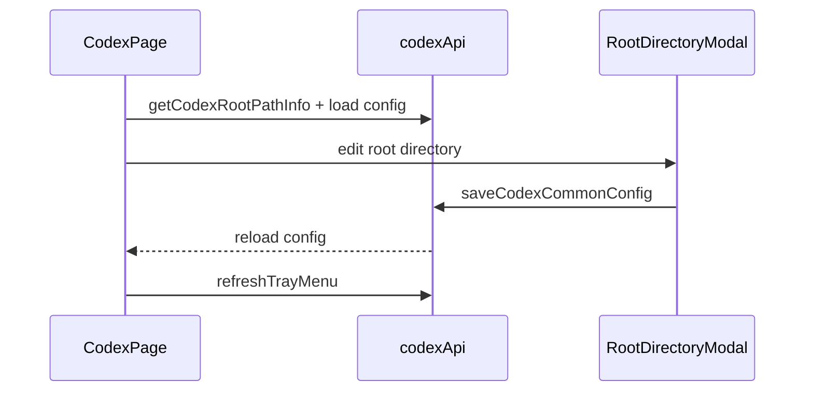

# Codex 前端模块说明

## 一句话职责

- `codex/` 页面负责 Codex provider/common config、根目录管理、prompt、plugin 与导入交互。

## Source of Truth

- 根目录来源于后端 `getCodexRootPathInfo()`，并决定页面实际针对哪份 `config.toml` / `auth.json` / active global prompt 文件工作。
- provider 最终生效状态以后端应用结果为准，前端本地状态只是展示。
- prompt 管理最终作用的是当前根目录下的 Codex active global prompt 文件。后端会按 upstream 语义优先使用非空 `AGENTS.override.md`，否则使用 `AGENTS.md`。
- 历史同步入口作用于后端解析出的 Codex history source。会话管理来源为 `all` 时，历史同步这种写操作默认落到本机；当前 Codex root 本身是 WSL Direct 时只作用于该 WSL root。前端只展示后端状态和触发命令，不自行推断数据库或 session 文件格式。

## 核心设计决策（Why）

- Codex 与 Claude Code 一样使用共享根目录编辑逻辑，保证 `custom/env/shell/default` 语义一致。
- provider 导入同样先做 `sourceProviderId` 冲突判断，避免重复导入同一来源时形成歧义。
- 页面操作后需要显式 `refreshTrayMenu()`，因为托盘是另一套消费者，不能假设 React 页面重绘就等于托盘已刷新。
- provider 表单的模型获取分两条链路：官方订阅读取后端共享模型目录，自定义网关继续走通用 `fetch_provider_models`；不要让官方模式依赖 Base URL/API Key 输入。

## 关键流程

## 易错点与历史坑（Gotchas）

- 不要把页面上的 root path 只当展示信息。它直接决定当前读写哪份 `config.toml` / `auth.json` / active prompt 文件。
- 导入 provider 时的冲突分支、favorite provider 备份和 tray refresh 是一组相邻语义，改一个时通常要一起检查。
- 前端表单不要引入比后端更强的 paired validation，尤其是可选字段和导入数据兼容性相关字段。
- 普通“新建 provider”和“复制已应用 provider”都应走普通创建语义，默认不自动应用；不要因为复制源当前已应用，就在提交对象或页面状态里把新记录当成已应用配置处理。
- 页面里的 `__local__` 不是普通新增 provider，而是当前生效本地配置的收编入口；当用户把它保存为正式 provider 时，产品语义是“把当前生效配置正式落库”，不是“基于当前配置再新建一个未应用草稿”。
- UI 上 `__local__` 即使后端 `isApplied=true`，也不要显示「已应用」标签、选中高亮或「应用」按钮；只保留本地来源提示。用户应通过编辑后保存收编入库，再进入正式 applied 管理语义。
- `__local__` 还没有正式 provider 数据库记录，不能进入依赖持久化 provider ID 的官方账号管理链路；页面应先让用户保存收编，再展示或调用官方账号接口。
- 官方订阅模型列表只是辅助填写 `model` 字段。账号套餐、quota 和真实可调用性以 Codex 官方账号明细/运行时请求为准，前端不应在模型下拉阶段做额外拦截。
- 官方账号额度窗口由后端解析并投影；页面只展示返回的 `5h`、weekly、monthly 明细，不根据套餐、字段顺序或文案自行推断。
- 页面粘贴导入 `auth.json` 时只把内容提交给后端保存为账号快照；运行时 `auth.json` 只有在用户点击“应用”后才会更新。
- 官方账号卡片的额度摘要仍以百分比为主；重置信息（各窗口重置时间、剩余时长、重置卡数量）另起 10px 辅助文字一行，统一走 `utils/codexQuotaDisplay.ts`。剩余时长由绝对时间戳在渲染时计算，不要把相对文案落库或写进类型；重置卡数量只展示后端 `resetCreditsAvailable` 投影，前端不自行请求明细或推断。
- provider 模式只允许在空白新增 provider 时选择。模式入口并入表单顶部“渠道”选择行：空白新增可在“自定义/官方/内置渠道”之间切换；复制 provider 仍走创建新记录语义，但必须沿用源 provider 的 `category`；编辑已保存 provider 也必须保留既有 `category`，不要允许官方/自定义互相切换。
- 自定义模式下的内置供应商 endpoint 会填入 Base URL、API 格式和模型映射，但只锁定 API 格式，不锁定 Base URL；保存内置 endpoint 时只写 `meta.gatewayProfile={tool:"codex",profileId,endpointId}` 引用，`settingsConfig.config` 中的 `base_url` 必须使用用户当前表单里的 Base URL。切回普通“自定义”时必须清掉 `gatewayProfile`，只保留用户手动选择的 `apiFormat`；不要把 `providerType` / `apiKeyField` / `reasoningField` / `defaultMaxTokens` / 图片策略这类 profile 派生快照写进 provider meta。
- OpenAI Chat/Responses 的 Base URL 通常需要 `/v1` 后缀（例如 `https://api.openai.com/v1`）。表单只做文案提示 + 保存软确认（对齐 Grok / OpenCode）：`apiFormat` 为 `openai_chat`/`openai_responses` 且 base 去尾 `/` 后不以 `/v1` 结尾、也不是 `##` full URL 时 `Modal.confirm`；**禁止**静默自动补 `/v1`（会破坏 Anthropic 类、Gemini Native、反代前缀与 full-URL 配置）。
- 内置供应商 endpoint 的 Gateway meta 不只包含 `providerType` / `apiFormat`。如果 profile endpoint 带 `reasoningField` 或 `codexChatReasoning`，Codex provider 表单也只保存 `gatewayProfile` 引用；runtime 每次按当前 profile catalog 动态解析 effective meta，保证 ReasoningField 和 Codex -> Chat 多 vendor reasoning/thinking 矩阵跟随内置 catalog 更新。切回官方或普通自定义时不能伪造这些 provider 专属字段。
- 模型目录的编辑入口已经**不再放在供应商表单里**：表单只保留渠道级字段（provider profile / API 格式 / Base URL / 模型名称）并在模型名称下给出「模型目录已移到卡片的模型列表」提示。模型的新增、编辑、复制、删除、排序与批量删除都在供应商卡片的「模型列表」折叠区完成，修改即时持久化。官方订阅模式没有模型目录。
- 卡片模型列表只在 `category === 'custom'` 且不是 `__local__` 时显示（`web/features/coding/codex/components/CodexProviderCard.tsx`）。工具栏顺序照搬 OpenCode：`批量删除 → 模型测试 → 获取模型 → 添加模型`；行内是 `设为自动审批模型 / 设为默认（主模型）/ 编辑 / 复制 / 删除`，支持拖拽排序与多选批量删除。需要长期显示的主信息只有显示名、(上游模型 ID)、`上下文限制` 与「当前主模型」标记；行操作按 `ModelItem` 既有 hover-reveal（`styles.primaryAction`）隐藏，避免高密度列表被按钮占满。
- 模型行的身份是 `codexCatalogRowKey(item)`＝`(model, displayName)`，不是上游 model id：同一个上游模型可以用不同菜单显示名重复出现。**展示用的 `(id)` 必须是上游 `item.model`**，把 rowKey 当展示 id 会渲染出粘连文本（rowKey 内含 `\u0000` 分隔符）。行操作、批量选择与拖拽都以 rowKey 为键。
- 「设为默认（主模型）」写的是 `config.toml` 的默认 `model`，不是模型目录顺序；「设为自动审批模型」写 provider 级 `settingsConfig.autoReviewModelOverride`（每次只设一个，卡片顶部显示当前值并提供清除）。两者都不冲突：目录本身只生成 `model_catalog_json`。
- 主模型的默认思考档位和 `model` 走同一个指针：只要本次操作让目录行成为/继续作为主模型，就把该行的 `defaultReasoningLevel` 投影进 `config.toml` 的顶层 `model_reasoning_effort`（由 `resolveCodexDefaultReasoningEffort` + `buildCodexSettingsConfig({ reasoningEffort })` 完成）。该行没有声明默认档位时回落到 `CODEX_FALLBACK_REASONING_EFFORT`（当前为 `xhigh`），不能用空值清掉；只有主模型 id 在目录里完全找不到时才保持 `model_reasoning_effort` 原值不动。编辑主模型行的默认档位、删除/批量删除/连通性移除导致默认模型回落到新行、以及首次采用目录第一项时都按同一规则处理；与主模型无关的目录编辑不得改写它。
- 模型目录的持久化统一走 `CodexPage.persistProviderCatalog` → `buildCodexSettingsConfig` → `utils/codexProviderCatalogSave.ts` 的 `saveCodexProviderCatalogWithGatewayReengage`。Codex 是 direct → single → failover → **aggregate** 四态，必须在 restore → save 之后回放 aggregate（`aggregateConfig`），不能照抄只支持到 failover 的 Grok helper。保存后要刷新 favorite provider 快照与托盘。
- `CodexModelFormModal` 里「默认档位必须属于已勾选档位」的清理只能挂在 `reasoningLevels` Select 的 `onChange` 上，不能写成依赖 `reasoningLevels` 的 `useEffect`：打开弹窗时回填 effect 与校验 effect 在同一轮 commit 里执行，校验 effect 的闭包仍持有打开前的空 `reasoningLevels`，会把刚回填的 `defaultReasoningLevel` 立刻清成自动（已实测复现）。Grok 弹窗的 `reasoningEffort` 有同一竞态，已用同样方式修复。
- `persistProviderCatalog` 只在必要时改动 `config.toml` 的默认模型：重命名了默认行、删除了默认行、或本来没有默认模型时才写；其它模型编辑必须原样保留当前默认 `model`。删除/批量删除默认行时回落到目录第一项，目录清空则清掉默认模型。
- 「获取模型」也移到卡片，复用共享 `FetchModelsModal`（`priorityOwnedBy={['openai']}`），合并语义仍走 `importModelsIntoCatalog`：按 `orderedModelIds` 对齐顺序、只有用户明确勾选才清理、保留同一上游模型的不同菜单别名与自定义字段。发现 SDK 由 provider 存储的 API 格式推导（`anthropic_messages → @ai-sdk/anthropic`、`gemini_native → @ai-sdk/google`、其它 → `@ai-sdk/openai`）；这只是列表探测，不改写 Gateway 推理协议或已保存 Base URL。
- 新增/编辑模型走独立弹窗 `CodexModelFormModal`，字段映射 1:1 到 `CodexCatalogModel`：上游模型 ID、显示名、上下文窗口、思考档位 + 默认档位、速度等级、输入/输出模态；「选择预设模型」按渠道 SDK 分组展示（主分组 + 其他 SDK），`fillCodexCatalogModelFromPreset` 负责补齐显示名、上下文窗口、输入/输出模态与档位。预设入口只有在父层传入 `presetNpmType` 时才渲染，Codex 页必须用 `getCodexProviderSdkType(provider)`（由 provider 存储的 API 格式推导）传入；漏传会让整条「选择预设模型」链接消失，不是样式问题。**图片输入不再暴露为可编辑项**：默认就是自动（不写 `supportsImage`），只有存储里已有的显式值必须原样往返，因此弹窗用 `getFieldsValue(true)` 读值，不能让未渲染字段被丢掉。
- 内置渠道 endpoint 的目录播种仍发生在表单里选择渠道时（`setCodexCatalogModels(endpoint 目录)`）；表单保存继续通过 `getFinalSettingsConfig` 携带当前 `catalogModels` 与 `autoReviewModelOverride`，所以只改渠道字段时不会丢目录。不要用 `form.setFieldValue('modelCatalog', ...)` 伪造保存。
- `modelCatalog.models` 不是只给模型下拉用的三字段列表。`supportsImage`、`vision`、`attachment`、`modalities` 这类能力字段会被 Gateway runtime 用来判断 text-only/vision 行为，前端解析和保存规范化时必须保留显式 boolean（尤其是 `false`）和 `modalities.input/output`，不能只写回 `model/displayName/contextWindow`。
- 连通性测试（卡片头部与模型列表工具栏共用同一入口）覆盖「`config.toml` 默认模型 ∪ 目录全部上游 model id」，由 `buildCodexConnectivityModelIds` 计算；测试失败后可移除选中模型（`ProviderConnectivityTestModal` 的 `removableModelIds` + `onRemoveModels`），移除同样要回落默认模型并保留用户未删除的选择。
- “导入模型映射”复用共享 `FetchModelsModal`，按 `orderedModelIds` 对齐已有及新增映射的展示顺序；本次接口未返回的行保持相对顺序垫底。已存在判断、合并及移除必须统一对 model id 去首尾空格，但不能改写大小写；保留同一请求模型的不同菜单别名及用户自定义字段。移除只在用户明确勾选清理时执行，不能因上游模型列表波动隐式删除。Codex 通过可选的 `priorityOwnedBy={['openai']}` 置顶 openai，共享组件默认无厂商偏好。
- 导入与手动输入模型共用 `fillCodexCatalogModelFromPreset`：以模型 ID 精确匹配预设，补齐空的菜单显示名、上下文窗口、输入/输出模态、思考档位和默认档位。模态只保留 Codex 支持的 `text/image/audio`（preset 里的 `pdf/video` 等会被丢弃），已存在的显式 `modalities` 不覆盖。档位优先读取预设 variants 的 OpenAI `reasoningEffort` / Anthropic `effort` / Gemini `thinkingConfig.thinkingLevel`，仅保留 Codex 支持的档位；旧预设只声明 `reasoning=true` 时沿用手动表单的 `low/high/max` 默认。默认优先 high。新导入行无预设名称时可用 API 名称；已有映射不补写空字段或覆盖自定义值。预设没有声明速度等级，不应据模型名称自动启用 Fast/Ultrafast；保存后重新读取必须保留已有 `serviceTiers`。
- 内置渠道的模型目录只在选择渠道时初始化；保存必须直接使用已校验的当前默认模型和 `codexCatalogModels`，不得在提交尾部重新覆盖为 endpoint 预设，也不能把用户清空的映射恢复回来。“获取模型”和“导入模型映射”都按表单当前生效的 API 格式选择发现 SDK/原生模式；这只是模型列表探测，不改写 Gateway 的推理协议或已保存 Base URL。
- Codex 的 `settingsConfig.modelCatalog` 由 `useCodexConfigState` 的 `codexCatalogModels` 状态持久化，不是普通 Form 字段。内置 endpoint 提供 `modelCatalog` 时，应同步该 hook 状态；不要用 `form.setFieldValue('modelCatalog', ...)` 伪造保存。
- Codex 的“模型名称”与“模型映射”是两份独立数据：前者是 `config.toml` 的当前默认 `model`，后者只生成 `model_catalog_json`。不得用映射第一项填充、覆盖或兜底模型名称；保存时应基于已校验的表单快照直接构建 `settingsConfig`，不要先异步 `setState` 再立即读取 hook 闭包。
- `modelCatalog.models` 不是只给模型下拉用的三字段列表。`supportsImage`、`vision`、`attachment`、`modalities` 这类能力字段会被 Gateway runtime 用来判断 text-only/vision 行为，前端解析和保存规范化时必须保留显式 boolean（尤其是 `false`）和 `modalities.input/output`，不能只写回 `model/displayName/contextWindow`。
- 「自动审批模型」仍是 provider 级单值（`settingsConfig.autoReviewModelOverride`），但 UI 已移到卡片的模型列表：每行可「设为自动审批模型」（同样是 hover 才显示），列表内容区顶部以 10px 辅助文字显示当前值并提供「清除自动审批模型」链接。后端 apply 时默认投影到 catalog 全部 entry；若默认 model 不在目录中会自动补入，确保 Codex 能读到 override。不提供应用范围选项。
- Codex 内置 Anthropic/Claude 协议 endpoint 如果没有显式 `modelCatalog`，添加供应商时应从同一渠道的 Claude endpoint 角色模型派生初始模型映射；如果 endpoint 自带 `modelCatalog`，仍以 endpoint 自身目录为准。派生逻辑只用于补齐添加表单的初始值，不能改变 Base URL 可编辑和保存用户当前输入值的语义。
- Gateway 现在是 direct → single → failover → aggregate 四态，模式判断只走 `shared/gateway/providerProtocol.ts`。single 入口在已应用 provider 卡片的“网关代理”按钮；single/failover/aggregate 接管期间都必须锁定其他 provider 的“应用”入口，failover 时卡片额外显示 P0/P1 优先级，切 P0 必须先恢复直连。provider 列表折叠标题行里的接管状态胶囊和聚合模式入口是 `GatewayFailoverButton` + `GatewayAggregateButton`，两者必须共用 `shared/gateway/gatewayStatusChip.module.less` 的 chip 样式，聚合入口只在接管生效时出现，聚合生效时用主色 chip 表示当前模式。
- 前端不要假设 Codex prompt 文件名永远是 `AGENTS.md`。展示路径、删除已应用 prompt 后的刷新和同步结果都以后端返回/事件为准。
- 插件页的全部启用/全部禁用只作用于“已安装”Tab 中当前 runtime 的已安装插件，不作用于市场可安装列表；全部启用需要允许后端同时开启 plugins feature，成功后仍按现有规则提示用户重启 Codex。
- 市场添加入口与 Grok/Claude 对齐：marketplaces Tab 工具栏与空态各有“添加”按钮，打开带文本输入框的 Modal。输入框接受 git 仓库 URL / GitHub `owner/repo` 简写 / `marketplace.json` 直链 / 本地目录；“选择目录”按钮把本地目录回填到输入框（不直接提交）。提交统一走 `addCodexPluginWorkspaceRoot({ path })`，由后端识别源类型并下载/克隆；失败时 Modal 保持打开（`marketplace-add-failed`）。不要为本地目录再加单独的直选入口，避免重复。
- 历史同步入口放在会话管理区域标题栏右侧，不属于 provider 卡片或已应用 provider 菜单；同步和恢复都是高影响本地写操作，必须使用后端返回的来源、统计、备份路径和锁等待信息展示结果，恢复最新备份必须强确认。历史同步默认只修复 provider 路由，不应在 UI 文案中承诺会同步或改写 model。
- “统一 Codex 会话历史”入口属于 Codex 更多选项，不属于手动历史同步弹窗；开关行应沿用 SidebarSettingsModal 的左右布局，说明文字放在 Switch 下方。开启确认里“迁入现有官方会话历史”默认不勾，关闭确认里只有存在当前 Codex root 的迁移账本时才提供按账本恢复；Gateway 接管期间前端应禁用开关并提示先恢复直连。
- “切换第三方时保留官方登录”同样在更多选项里，但语义不同：它会影响当前已应用渠道的 live 投影，不能只写 settings store。前端必须走 `setCodexPreserveOfficialAuthOnSwitch` → 后端 `set_codex_preserve_official_auth_on_switch`，由后端重投影（未接管直接 apply；Gateway 下 restore → apply → re-engage）。不要前端自己 `saveSettings` 或拼 Gateway 开关顺序。
- 记忆管理（`CodexMemoriesPanel`，issue #296）挂在 Codex 页 sidebar 第 5 分区（`codex-memories`），默认折叠（`memoriesListCollapsed` 受控，对齐 plugins 分区模式）；侧边栏导航点击该分区时必须展开。UI 形态对齐会话管理：本机/WSL 来源切换（复用 `sessionManager.sourceMode.*` 文案）、相对路径面包屑导航、左侧紧凑表格 + 右侧详情分栏。
- memories 来源切换后 `currentDir`、选中文件和批量选择必须整体重置；本机来源不可用时禁用本机选项并自动落到 WSL，必须同时更新真实 `sourceMode` 与 remembered mode，不能只从当前列表派生 effective mode，否则 WSL 读取失败清空列表时会反复切回本机并重试。异步列表仅允许当前来源/目录的最新请求更新结果，旧写操作回调不得发起跨上下文刷新；保存、重命名、删除的回显还需核对当前文件，避免旧结果覆盖新选择。手动切换来源立即使旧请求失效，同来源根目录的重复点击不得取消正在加载的请求；WSL 选项只显示 "WSL"，不带 distro 名。
- `list` 响应的 `unavailable=true` 表示请求来源在本机不存在：列表区显示“来源不可用”空态并禁用新建/打开/删除/清空入口，来源切换仍可用；不要把该状态当成加载失败弹错误。页面级 `refreshToken` 变化只刷新列表，不得重置用户的目录导航与选中状态。
- `MEMORY.md`、`memory_summary.md`、`raw_memories.md`、`rollout_summaries/*` 的详情区要显示“Codex 会自动重建”辅助提示（10px tertiary 文字）；空态必须区分“目录为空”（表格内 Empty）和“未选中文件”（详情区 Empty）两种。
- 编辑保存走 `write_codex_memory_file`：.md 预览用共享 `MarkdownPreview`，编辑统一用 `MarkdownEditor`（自带编辑/预览切换），非 .md 只读预览用 `PlainTextEditor`。文件大小/字符数显示在详情头部，不要弹窗编辑。
- 新建记忆文件必须传 `createNew: true`，由后端拒绝重名，不能复用默认覆盖保存；加载失败时来源能力尚未知，允许用户切换来源重试，不得把错误状态当成两个来源都不存在。

## 跨模块依赖

- 依赖共享 `RootDirectoryModal` / `useRootDirectoryConfig`。
- 依赖后端 `codex::commands` 和共享 favorite provider、All API Hub 组件、以及共享 `ImportFromCcSwitchModal`（CC Switch 只读导入；无 db 不显示按钮；Codex TOML 经白名单重建后写入）。
- 间接受 `settings/` 和 `runtime_location` 的 WSL Direct 语义影响，但页面本身只显示 path info。

## 典型变更场景（按需）

- 改根目录逻辑时：
  同时检查页面顶部 path info、modal 回填、历史同步目标和保存后 reload。
- 改 provider 删除/导入时：
  同时检查冲突处理、favorite provider 兜底和 tray refresh。
- 改会影响 live 投影的更多选项开关时：
  走专用后端命令重投影当前已应用渠道，不要只写 settings；参考「保留官方登录」。

## 最小验证

- 至少验证：修改根目录后页面重新读取到新的路径来源。
- 至少验证：导入同源 provider 冲突时有明确覆盖/副本分支。
- 模型目录改动运行 `pnpm test` 与 `pnpm exec tsc --noEmit`。`web/test/features/coding/codex/utils/codexCatalogModelRows.test.ts` 覆盖行身份、upsert/删除/排序、弹窗表单值往返、图片能力三态与连通性 model id 并集；`codexProviderCatalogSave.test.ts` 覆盖 single/failover/aggregate 的回放顺序。模型目录的浏览器检查（`pnpm test:codex-model-import`）目前仍指向已移除的表单内映射 UI，迁移到卡片模型列表前不要把它当作有效结论。
- 若本机存在 `~/.cc-switch/cc-switch.db`，Codex 页应出现「从 CC Switch 导入」；导入后带 `sourceProviderId=ccs:codex:...`、默认未应用；MCP-only 空壳不应进入列表。
- 改历史同步 UI 时，至少验证会话管理标题栏入口、来源切换、本机/WSL 状态弹窗、同步确认、恢复最新备份强确认和 Session Manager 刷新触发。
- 改「保留官方登录」开关时，至少验证：切换后不必再手动应用渠道；store 仅在后端成功后更新；失败不误翻转 UI。
- 改统一会话历史 UI 时，至少验证开启/关闭确认弹窗、迁移/恢复结果提示、Gateway 接管禁用态和 settings store 刷新。
