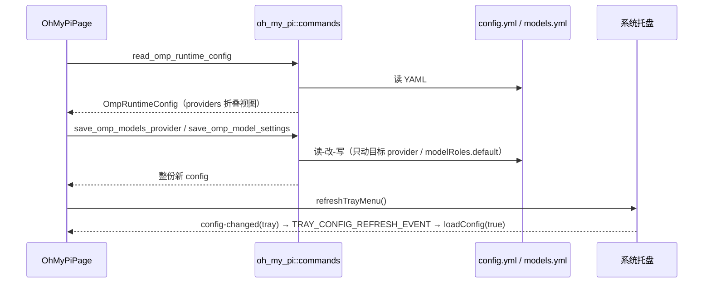
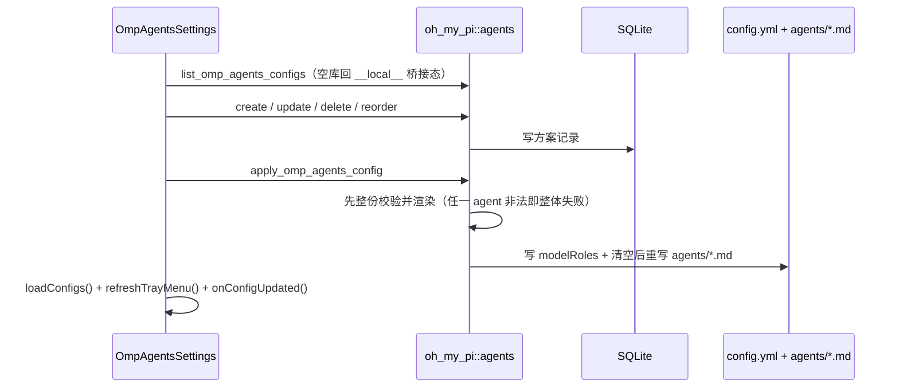

# Oh My Pi 前端模块说明

## 一句话职责

- `oh_my_pi/` 页面负责 OMP(Oh My Pi) 运行时的可视化编辑面：默认模型、供应商与模型目录、subagent 方案、扩展、全局提示词、其他配置、会话。

## 与后端的边界

- 全部读写都落在 OMP runtime 文件上，由 `tauri/src/coding/oh_my_pi/`（含 `agents.rs`）承担；`models.yml` 的配置值语义、`thinking.mode` 必填、subagent 方案的 DB 结构与 apply/clear 语义、`:level` 后缀解析规则的权威说明在 `tauri/src/coding/oh_my_pi/AGENTS.md`，这里不重复。

## 与 Pi 页的关系（先读这一节）

- 本页与 `web/features/coding/pi/` 同构但**不是同一套数据**：OMP 没有 `auth.json` / `settings.json`，凭据直接写在 `models.yml` 的 provider 里，默认模型是 `config.yml` 的 `modelRoles.default`。两页共享的是 `shared/*` 组件、`favoriteProviders` 的 payload 形状（`OmpFavoriteProviderPayload` 就是 `PiFavoriteProviderPayload` 的别名）与 `ompModelMetadata`/`piModelMetadata` 的词表，**不共享运行文件**。
- 推荐扩展清单目前是 Pi 那份的逐条副本（22 条、同序、同 `installSource`），而文件顶部的注释却写着「OMP 页面不内置 Pi 的推荐扩展列表」——注释已与代码不符。改其中一份时先决定是否两份一起改，不要相信那条注释。
- OMP **不挂载** `MagicContextSettings`：后端 `MagicContextHarness` 只有 `opencode` / `pi` 两个取值。推荐列表里保留 `@cortexkit/pi-magic-context` 只是因为装它有用；给本页加 `<MagicContextSettings harness="omp">` 会直接编译不过，先扩后端枚举。

## Source of Truth

- 本地文件状态源是 `readOmpRuntimeConfig()` 返回的 `OmpRuntimeConfig`；每个写命令返回**整份新 config**，`setRuntimeConfig(nextConfig)` 只更新本地快照，不做乐观更新。原生目录是独立、按根路径隔离的只读视图；刷新回包只取模型与目录错误，不能覆盖最新设置或表单。合并时以当前本地默认模型重算告警，YAML 同名模型优先。
- `providers` 是后端从 `models.yml`（+ `config.yml` 的 `modelRoles.default`）折叠出的只读视图。OMP 视图的 `credential` **恒为 `null`**（后端 `credential: None`）：卡片的「有凭据」判定来自 `modelsProvider.apiKey` 是否存在，不是 `credential` 字段。页面里几处把 `provider.credential` 传进收藏 / 分享的对象因此都是 `null`，属于既定事实而不是漏传。
- `settings` / `models` / `configContent` / `modelsContent` / `mcpContent` / `promptContent` 只服务预览弹窗与「其他配置」的初始切片，不是保存基底。
- subagent 方案的**主数据在应用数据库**（`listOmpAgentsConfigs` 等），`<agentDir>/agents/*.md` 与 `config.yml` 的 `modelRoles` 是 apply 的产物；空库时后端给出 `__local__` 桥接态（读本地 `modelRoles` + `agents/*.md`），它不是记录、不可删除，UI 也不给它「已应用」样式。

## 核心设计决策（Why）

- 模型设置卡同样是**变更即保存**（`onValuesChange` → `saveOmpModelSettings`），并有 `modelSettingsSaveSeqRef` 代次守卫。它与 Pi 的关键差异：**只有显式清空思考级别控件、或旧值对新模型不合法时，才把 `clearThinkingLevel` 置真**。切 provider / 切模型本身不得清掉全局 `defaultThinkingLevel`（OMP 对单个模型不支持的 effort 是 clamp，不是删全局键）。「设为默认模型」时若旧级别不适用，会回落到该模型的 `thinking.defaultLevel`，而不是像 Pi 那样直接清空。
- 供应商表单是 OMP 独有的「API 变更时自动补 Base URL」：`automaticProviderBaseUrlRef` 记录「当前地址是否仍由表单自动填入」。新建弹窗初始为自动态；用户手改或清空后转为手动态；编辑/复制现有供应商时直接是手动态（`undefined`）；重新打开新建弹窗重置。`OMP_API_DEFAULT_BASE_URL` 只收录端点稳定、不依赖用户资源的协议，Azure / Vertex / Bedrock / gemini-cli 不预填。回归：`web/test/features/coding/oh_my_pi/utils/ompProviderForm.test.ts`。
- 「获取模型」与「连通性测试」的能力判定集中在 `utils/ompDiagnostics.ts`，它同时回答三件事：目录请求用哪个连接、连通性是否可用、每个模型各自的连接。**混用连接不再是禁用理由**（issue #360）：目录端点退回供应商级 `api`/`baseUrl`，连通性按 `modelConnections` 逐模型测试，token 上限字段名跟着该模型解析出的 npm 走（Google 读 `maxOutputTokens`，其余读 `maxTokens`）。
- 模型弹窗对 OMP 用 `showOmpThinking`（写 `thinking` 结构）而不是 Pi 的 `showThinkingLevelMap`；保存时无条件 `delete nextModel.thinkingLevelMap`，因为 OMP 不认这个键。`cost` 必须四个字段齐全，否则整块不写（缺一个字段就会让整个 `models.yml` 校验失败、禁用所有自定义 provider）。
- **Codex 订阅卡片是「官方账号」共享组件的 OMP 宿主**（`OmpSubscriptionCard` → `OpenCodeStyleCard` + `OfficialAccountsSection` 的 `embedded` 变体），不是自建区块。账号行由「`OmpCodexAccount` → `OfficialAccountRowView`」映射而来，登录入口走 `loginAction` 插槽（导入 auth.json / 订阅登录 / 刷新三个动作）。改动卡片样式应改共享组件，不要在 OMP 侧分叉——这是 `9a1d3c35`、`557632cb` 两次提交统一三种卡片的原因。
- `loadConfig(silent, refreshCatalog)` 先结束本地配置加载，再由独立 effect 刷新原生目录；不得把 `refreshOmpCodexCatalog` 放进全局 Spin 的 await 链。首次进入运行目录和订阅卡片刷新触发一次目录发现；普通配置读取、保存、托盘事件、deeplink、subagent apply 不触发 CLI。异步响应必须检查根路径、请求代次与卸载清理，避免切目录、连续刷新或保存后迟到的回包覆盖当前视图。目录超时只显示订阅卡片的局部错误，本地设置与账号仍可使用；额度继续仅由逐账号按钮手动查询。
- 纯原生订阅（`openai-codex` 且没有 `models.yml` 覆盖）**不进供应商列表**，只渲染订阅卡片；一旦用户在 `models.yml` 里显式配了该 provider，卡片与供应商卡片同时出现，后者带「models.yml 覆盖配置」后缀——这是为了让用户能检查并移除自己的 API-key 配置，而不是把它藏起来。

## 关键流程

- 托盘事件由 `web/app/providers.tsx` 全局转发；本页监听 `TRAY_CONFIG_REFRESH_EVENT` 并 `preventDefault()`，用 `loadConfig(true)` 静默重读替代整窗 reload。

## 易错点与历史坑（Gotchas）

- **侧栏折叠键必须是 `oh_my_pi`，不是 `pi`**（已修复，勿改回）。本页曾读 `sidebarHiddenByPage.pi` 却写 `setSidebarHidden('oh_my_pi', …)`，导致「更多选项」里的侧栏开关**静默无效**——它翻转的是一个本页不显示的槽位，而 Pi 页（`PiPage.tsx` 读 `pi`）的开关状态被本页读去显示。`SIDEBAR_PAGE_KEYS` 里 `pi` 与 `oh_my_pi` 是两个独立键，每个 CLI 只碰自己那个。
- 侧栏菜单项 id 必须与 DOM 上 `data-pi-sidebar-section="true"` 元素的 `id` 完全一致（滚动靠 `document.getElementById`）。本页的分区 id 沿用 `pi-*` 前缀（`pi-model-settings` / `pi-providers` / `pi-agents` / `pi-extensions` / `pi-global-prompt` / `pi-other-configuration` / `pi-session-manager`），改名要同时改 `sidebarSections` 与 JSX。
- 页头显示的是**配置目录**（`rootPathInfo.path`）而非配置文件路径，这是 pi/ohMyPi 独有的真实差异；两页尚未迁移到共享 `CodingPageHeader`，迁移时应加 `configPathLabel` 之类的 prop，而不是把差异抹平。
- 「其他配置」只拥有 `config.yml` 的非受管切片：`modelRoles` / `defaultThinkingLevel` / `modelProviderOrder` / `modelRoleStorage` / `extensions` / `disabledExtensions` / `enabledModels` / `disabledProviders` / `modelTags` / `cycleOrder` 由 provider 卡片与 subagent 区块拥有，编辑器里看不到、保存时也不会写回。需要让用户手改这些键时走别的入口，不要把它们从隐藏列表里放出来。
- 供应商表单保存时**没有 credential 分支**：apiKey 只是 `modelsProvider.apiKey` 字段，删空即从配置里删掉。删除供应商也没有 Pi 的 scope 三选一——`deleteOmpRuntimeProvider(providerKey)` 直接从 `models.yml.providers` 移除该 key，默认 provider 的删除按钮渲染成禁用 + tooltip，批量删除前先把当前配置备份为 favorite provider。
- 批量删除的 `allIds` 必须过 `canBatchDeleteProvider`（排除默认 provider；来源含 `models_yml` 或配置里带 `apiKey`）。共享的 `backupProvidersBeforeDelete` 有一条失败即中止整批。
- 删除模型（单删 / 批量 / 连通性测试移除）若删的是当前默认模型，必须再调一次 `saveOmpModelSettings` 把 `defaultModel` 与 `defaultThinkingLevel` 都传空串；`clearThinkingLevel` 在这条路径上不传（保持 `false`），后端会沿用现值而不是把全局思考级别一并清掉——这正是 `OmpModelSettingsInput.clear_thinking_level` 存在的理由：「表单里的空值」不等于「用户要清除」。
- 切换 provider 后默认模型下拉的候选是「新 provider 的 `modelIds` ∪ 当前已保存值」，与 Pi 相同的孤儿值兼容策略。
- `fetchModelsProviderInfo` 在 `!supportsModelDiscovery` 时返回 `null`，`connectivityInfo` 在 `!supportsConnectivity` 时返回 `null`；共享弹窗在 info 为 `null` 时直接 `return null`。所以「按钮没禁用但弹窗不出现」几乎总是诊断判定把它拦掉了，先查 `getOmpDiagnostics`，不要怀疑弹窗。
- 卡片 `sdkName` 的兜底串是 `'omp'`。历史上这里曾误写成 `'pi'`，而 `sdkName` 会驱动 Fetch Models 的 SDK 分组与模型弹窗的 preset 匹配，写错会静默改变预设命中范围。真正喂给这两个弹窗的 SDK 名来自 `getOmpDiagnostics(...).npm`（以及模型弹窗的 `ompApiToSdkName(provider.api)`），`sdkName` 只是卡片上的展示字段。
- OMP 的日志文案大量沿用了 Pi 的措辞（`Failed to load Pi runtime config` 等），排查时不要靠文案判断模块，认命令名与文件路径。
- 「获取模型」/「连通性测试」必须带 `configValueMode: 'omp'`：后端按 OMP 语义解析 `apiKey` / header（精确大小写环境变量名或 `!cmd`），前端不解析模板、也不能把模板值拼进预览 URL。
- Fetch Models 命中 preset 时只借用能力元数据：写回 `models.yml` 的 model id 必须是上游返回的原文（含大小写）；OMP 侧还要把 provider 的 `api` 一起传进去，因为 `buildOmpThinkingFromPreset` 需要它推断 `thinking.mode`。
- 新增供应商时 API 下拉带场景说明（`OMP_API_DESCRIPTION_I18N_KEYS`），词表镜像上游 `ApiSchema` 的 9 个值；前后端都刻意不做枚举硬校验（上游 `Api` 对扩展开放），自定义值只能靠高级 JSON 编辑，不要给下拉加校验把用户挡在外面。
- 自定义 Subagent 弹窗的初始化 effect 依赖 `[open, initialValues]`：父组件必须把 `initialValues` memo 住（`OmpAgentsSettings` 的 `modalInitialValues`），`providers` 也通过 ref 传入而不进 deps。任何一次父页面重渲染新建对象都会把用户正在编辑的内容重置掉。
- 弹窗里**所有**自定义 agent（含 `task` 这类与核心 role 同名的内置覆盖）都要求非空 `description`——上游 `parseAgentFields` 会丢弃缺 description 的 agent，后端 apply 也会整份拒绝；保留名只有 `main` / `sub`，不要顺手把内置名也过滤掉。
- `ompAgentDraftToConfig` 只更新受管字段，未知字段由弹窗的「高级 JSON」原样携带；清空字段是**删键**而不是写空串。`prewalk` / `advisor` 允许布尔与 `"true"` / `"false"` 字符串两种形态，写回时保持这个兼容。
- subagent 区块的三条破坏性/语义约束：删除方案**不会**动正在运行的文件；「清除已应用」会重置方案接管的 9 个核心 `modelRoles`（方案外的自定义 role 保留）并清空 `agents/*.md` 目录；禁用「已应用」方案等同撤回运行目录，所以下拉里的开关必须走二次确认（`handleToggleDisabled` 专门为这条分叉）。
- 编辑 `__local__` 桥接态走的是「新建并立即 apply」——保存后本地运行配置就变成了一条受管方案。
- 拖拽排序是乐观更新 + 失败回滚（`reorderOmpAgentsConfigs`），不要在失败分支里保留新顺序。
- 扩展区与 Pi 同构但走 `omp plugin` 命令；「打开目录」用 `invoke('open_folder')`。`omp` 二进制路径来自「更多选项」的 `CliManualPathSetting commandName="omp"`（后端 `cli_manual_paths` 的 key 就是 `omp`，`pi` 是另一个 key），不要在页面里另做探测。

## 跨模块依赖

- 后端 `oh_my_pi::*` 命令（`web/services/ohMyPiApi.ts` 一一对应）、prompt presets 走 `ohMyPiPromptApi`。
- `shared/`：`useRootDirectoryConfig` + `RootDirectoryModal`、`GlobalPromptSettings`（`promptFileName="AGENTS.md"`）、`SessionManagerPanel tool="oh_my_pi"`、`providerList`（搜索/排序/批量/最近使用）、`providerConnectivity`、`favoriteProviders`（`omp:` 前缀）、`allApiHub`、`ccSwitch`、`providerShare`（`useProviderSharing('omp', …)`）。
- `utils/ompModelMetadata`（thinking 词表与 `thinking.mode` 推断，必须与后端及上游 schema 同步）、`utils/ompApiOptions`、`utils/ompDiagnostics`、`utils/ompAgentsUtils`。
- 本页同样**不参与 Gateway 接管**（OMP 不在 `GatewayCliKey::supported_mvp()` 里，只进用量统计），页面没有网关代理胶囊 / 恢复直连。
- `web/services/ohMyPiApi.ts` 里的 `listOmpAgents` / `saveOmpAgentFile` / `deleteOmpAgentFile` 与 `utils/ompAgentsUtils` 的 `buildOmpBuiltinAgentConfig` / `hasExplicitOmpAgentConfig` / `getOmpAgentModelDisplay` / `formatOmpModelRoleEntry` / `OMP_CORE_MODEL_ROLE_KEYS` 等目前**没有 UI 入口**（只有单测引用），是给后续「`agents/*.md` 文件编辑器」铺的地基（后端同名命令同样待接）。不要当死代码删除，也不要以为前端已经在用。

## 典型变更场景（按需）

- 新增 provider 字段：同时检查 `openProviderModal` 回填、`handleSaveProviderModal` 的写入与 delete 分支、`buildOmpFavoriteProviderConfig` 的归一化、`fetchModelsProviderInfo` / `connectivityInfo` 的取值。
- 改 API 自动填地址：只改 `utils/ompApiOptions.ts` 与 `handleProviderApiChange` / `handleProviderBaseUrlChange` 三处，并跑 `ompProviderForm.test.ts`（该测试用 VM 从 `OhMyPiPage.tsx` 里按标识符名提取这几个函数，重命名或搬走会让它失败）。
- 改 subagent 方案结构：前端 `ompAgentDraftToConfig` / 弹窗校验、后端 `parse_role_string` / `render_agent_files`、以及 `:level` 后缀规则必须同一条口径。
- 改思考级别：`web/utils/ompModelMetadata.ts`、`utils/ompAgentsUtils.getOmpThinkingOptionsForModel`、模型弹窗、后端 `is_valid_global_thinking_level` 四处同步。

## 最小验证

- 打开本页：模型设置卡显示 `modelRoles.default` 与 `defaultThinkingLevel`；供应商列表含内置渠道但不显示未配置的内置 provider。
- 切换默认模型：`config.yml` 的 `modelRoles.default` 变为 `provider/modelId`；只切 provider 或只切模型时全局 `defaultThinkingLevel` 不被清空。
- 新建供应商：选 `anthropic-messages` 自动填入 `https://api.anthropic.com`，手改成自定义地址后再切 API 不回填；编辑或复制现有供应商时不自动填。
- 只填部分 `cost` 字段保存模型：整个 `cost` 不写入；模型弹窗保存后配置里不出现 `thinkingLevelMap`。
- 一个 provider 下混用协议（如 `openai-responses` + 单个模型 `anthropic-messages`）：获取模型按钮仍可用（走供应商级端点），连通性测试按模型各自连接逐个发起。
- subagent：新建方案 → apply → `<agentDir>/agents/*.md` 与方案一致、`config.yml` 的 `modelRoles` 只被接管 9 个核心 role；含缺 description 的 agent 时 apply 整体失败且目录不变；「清除已应用」后目录为空；禁用已应用方案会先弹二次确认。
- 手工在 `config.yml` 写一个自定义 role（如 `my-role`），apply 只配核心角色的方案后该 role 仍在。
- 方案里写 `ollama/qwen2.5:14b` 这类字面 model id，打开弹窗再保存后逐字不变（`ompAgentsUtils` 单测覆盖）。
- 改诊断逻辑时跑 `node --test web/test/features/coding/oh_my_pi/utils/ompDiagnostics.test.ts`；改模型映射时跑 `ompFetchedModels.test.ts`；改 subagent 工具函数时跑 `ompAgentsUtils.test.ts`。
- 未配置 `models.yml` 的 `openai-codex` 只以订阅卡片出现；在 `models.yml` 里加该 provider 后，卡片与供应商卡片同时出现且后者带「models.yml 覆盖配置」。
- 打开页面后连续保存模型/供应商多次，`models.db` 的修改时间不变；点订阅卡片的刷新按钮后才变化（证明 `omp models` 只在显式刷新时执行）。
- 任何写操作后托盘菜单同步（`refreshTrayMenu()` 不可省）。
