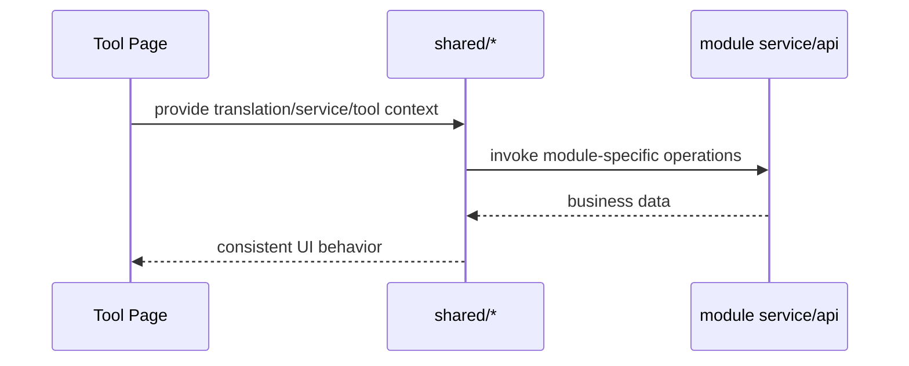

# Coding Shared 前端模块说明

## 一句话职责

- `shared/` 提供多个 coding 页面共用的前端语义层，不拥有独立业务主数据，但封装了跨模块必须一致的交互规则。

## Source of Truth

- `shared/` 中的大多数组件只是消费各模块自己的 service/store，不能反过来成为业务事实源。
- 根目录来源、prompt 列表、session 数据、favorite provider、provider 诊断等真实数据都在各自 owning module 或后端命令。
- `shared/` 真正需要维护的是“相同概念在不同页面的统一解释”，例如 root path source、favorite provider storage key、session tool API 形态。

## 核心设计决策（Why）

- 供应商「分享」从当前记录或 runtime view 生成快照，复用 `deepLink/ProviderTransferModal` 和统一后端导入入口；新增卡片入口使用 `providerShare/useProviderSharing` 保持完成事件刷新。独立 API Key 才可迁移，官方 OAuth 不随分享导出；模型目录的不同连接分别分享。协议与边界见 `web/features/shared/deepLink/AGENTS.md`。

- `configSaveBase.ts` 是「只拥有配置文件一部分的编辑面如何落盘」的共享规则：保存前必须重读文件，读得到就用文件副本做基底（`pickConfigSaveBase()`），读不到（notFound/parseError/error）才回退页面内存副本。原因是隐藏字段由别的入口直接写文件（MCP 页、托盘、深链导入、备份恢复），用陈旧内存副本合并会把它们整段回退——issue #406（OpenCode「其他配置」失焦把 MCP 页刚加进 `opencode.json` 的 server 写没了）与 OpenClaw 同形缺陷都源于此。新增这类编辑面（或给现有编辑面加自动保存）时先接这个规则，不要自建第二套判断。回归：`web/test/features/coding/shared/configSaveBase.test.ts`。
- `useRootDirectoryConfig` + `RootDirectoryModal` 把 Claude/Codex 的根目录编辑语义统一起来，避免两个页面对 `custom/env/shell/default` 的解释漂移。
- Claude/Codex/Grok CLI/Gemini CLI 复用共享根目录交互，而 OpenCode/OpenClaw 继续使用各自的配置文件路径弹窗；这是“根目录模块”和“文件路径模块”的前端分层，不要为了复用把两类语义硬揉到一个 modal 里。
- `favoriteProviders.ts` 用 source 前缀和 payload 约定把 OpenCode/Claude/Codex/OpenClaw 的收藏 provider 统一建模，避免不同页面各存一套不兼容 key。
- `GlobalPromptSettings`、`SessionManagerPanel`、`ProviderConnectivityTestModal` 等共享组件都要求业务方通过 service/api 注入，不自己硬编码某个模块的存储细节。
- 连通性 `apiFormat` 与 npm 分开传递；OMP 的 Codex 专用 Responses 标记必须贯穿单项弹窗和批量请求，批量也必须保留供应商 headers。专用 Codex 诊断强制流式，禁用不适用的温度/输出上限控件；端点转换由调用方负责，不回写收藏或运行时配置。
- 连通性视觉探测（issue #410）是共享语义：`providerConnectivity/visionProbe.ts` 是「声明视觉能力 vs 实测结果」比对的唯一纯函数源（`declaredVisionCapability` 读 `supportsImage`/`vision`/`attachment`/`modalities.input`；`visionProbeMismatchesDeclaration` 只在实测为 `passed`/`failed` 且声明明确时判不一致）。请求侧 `visionProbe` 与结果侧 `visionStatus`/`visionError` 由各页面弹窗透传；不要把比对逻辑复制进各 CLI 页面。回归：`web/test/features/coding/shared/providerConnectivity/visionProbe.test.ts`。
- Grok 连通性测试的 modelIds 只能是上游模型 ID。`settingsConfig.defaultModelKey` 是本地 catalog key（可能是 `custom`），不是 API model 名；必须从 `modelCatalog.models[].model` 取。
- `SessionManagerPanel` 的标题栏可通过 `extra` 注入模块自有动作；动作归 owning page 处理，shared 面板只负责摆放入口，不接管模块业务状态。
- 删除确认里的 Codex 无项目对话残留清理（issue #400）是 shared 面板里唯一一处模块专属**删除语义**，刻意收进 `codexCleanupOptions.ts`（本面板的决策：preview→行与默认勾选，空目录默认勾、非空默认不勾、含 git 或不存在的目录不提供）+ `codexCleanupDialog.tsx`（弹窗内容）而不是散在面板里：结果文案与 `tool === 'codex'` 判定都必须两侧共用。**与残留清理弹窗共用的口径**（`isRemovableWorkspace` 与 `describeCleanupReport`/`reportCleanupOutcome`，后者带 failure > skip > success 的优先级）在 `codexCleanupPolicy.ts`：这个模块只允许 type import，因为 Codex 页会以相对路径引用它并跑 node 单测。**两个删除入口都要走同一套**：列表面板 `SessionManagerPanel` 与详情页 `detail/SessionDetailPage`（改一处漏另一处会让详情页删除静默留下残留）。`Modal.confirm` 的内容只渲染一次，勾选状态由 dialog 组件持有并通过 `onChange` 回传，调用方用普通局部变量在 `onOk` 里读最新值；preview 失败必须回退到原确认弹窗，**不得阻断删除**。清理结果是独立消息（成功/警告），与删除成功提示分开，因为会话已经删掉了。
- `sessionManager/detail/` 是共享会话详情二级页和 workbench。它只消费后端 normalized message/block 契约，并通过 domain helpers 做搜索、过滤、导航、工具块配对和工具展示归一化；不要在 renderer 组件里直接读取某个 CLI 的 raw message shape。
- `allApiHub` 共享 modal 和模型缓存属于“共享交互层”，不是某个页面的私有实现。
- `gateway/providerProfiles.ts` 是前端 Gateway 内置供应商 profile 的共享内存态，启动时从后端缓存/bundled defaults 加载，再由远端刷新更新。它只提供 catalog、订阅和 endpoint 推断 helper，不持久化业务 provider。当前共享 tool key 覆盖 Claude Code、Claude Desktop、Codex、Grok CLI、Kimi Code 和 Gemini CLI；其中 Kimi Code 只是类型上被接受，bundled catalog 暂无 `tools.kimi` 节点（Kimi 暂无已验证内置 endpoint，后端 runtime 不解析其 gatewayProfile 引用）。新增内置 endpoint 时应按对应 `tools.claude` / `tools.codex` / `tools.grok` / `tools.gemini` 写入（为 Kimi 提供 endpoint 时需同步后端 `SUPPORTED_PROFILE_TOOLS` 与 catalog `tools.kimi`），而不是让页面靠模型名或 URL 猜供应商。Grok endpoint 默认机械复用已验证的 Codex OpenAI 兼容 endpoint 数据，协议差异继续由 Grok `api_backend` 和 Gateway transformer 处理。
- `management/` 下的控件和 `VirtualGrid` 只提供高密度管理页的纯 UI 行为，例如原生按钮、菜单、搜索、分段控件、空/加载态和可视区渲染；它们不保存业务选择、搜索、分组、排序或同步状态。
- `providerList/` 是全部 coding tab 供应商列表共享的搜索 / 排序 / 最近使用语义层（纯函数 + `useProviderListSort` + `ProviderSortDropdown` + `ProviderSearchInput`）。排序模式与最近使用时间存储在后端 settings 单例的 `provider_sort_modes` / `provider_last_used` 嵌套 key（`tauri/src/settings/provider_list_state.rs`，commands 为 `get_provider_list_state` / `save_provider_sort_mode` / `record_provider_last_used`），module key 沿用 `favoriteProviders.ts` 的 source 前缀约定。排序模式只是前端展示层操作，永远不改后端 provider 返回顺序；`custom`（默认）即拖拽落盘的 `sort_index` / 配置文件顺序。这张 `sort_index` 顺序是「供应商优先顺序」的唯一事实源：网关聚合模式的站点顺序直接复用它（见 `coding/gateway/AGENTS.md` 的聚合站点顺序约束），不要在别的页面再存第二份顺序。
- `management/useAutoGridColumns` 是排序模式复用浏览模式自适应列数的共享 hook：浏览分支由 `VirtualGrid` 内部按容器宽度算列数，排序分支（完整列表渲染、不走虚拟化）用「每行展示自动」(`gridColumnSetting === 'auto'`) 时没有那个计算，容易各自写死列数导致同一行卡片数在浏览/排序间漂移。该 hook 用 callback ref 挂 `ResizeObserver`，与 `VirtualGrid` 用同一套 `Math.max(1, Math.min(maxColumns, Math.floor((w + gap) / minColumnWidth)))` 公式，消费方把 `containerRef` 放到排序列表容器、用返回的 `columnCount` 写 `--management-grid-columns` CSS 变量即可。选 callback ref 而非 `useRef + useEffect`，是因为排序/浏览分支切换时容器是条件挂载、ref 在 layout 后才可靠；`enabled=false` 时不监听并返回 `undefined`，让固定列（`gridColumnSetting !== 'auto'`）路径完全不受影响。容器 CSS 的 `--management-grid-columns` 回退值要选接近宽屏 auto 结果的稳定常数（如 `repeat(3, minmax(0,1fr))`），避免 `ResizeObserver` 首个回调落地前首帧跳到 4 列再回跳。
- `magicContext/` 是 OpenCode 和 Pi 共用的 CortexKit 用户级配置管理入口。它只消费后端 `magic_context` 文件命令和调用方传入的安装状态，不拥有插件安装、扩展安装、项目级配置或配置主数据。
- `toolIcon/` 是 Skills 与 MCP 共用的工具品牌图标组件（见 `shared/toolIcon/AGENTS.md`）。它只做图标解析与暗色适配，不持有工具清单；Skills/MCP 都从共享路径导入，不再在各自模块内维护第二套品牌映射。
- `CodingPageHeader.tsx` 是 coding tab 页面头的**目标实现**（标题行 + 官方文档/预览配置链接、配置路径行 + 自定义/打开/刷新按钮、右上更多选项）。**迁移进行中**：目前 Claude Code、Codex、ZCode、OmO Native、Kimi 五页接入，其余页面仍是各自内联的一份。**新增工具页面直接用它，不要再内联复制**；接入清单见 `docs/new-cli-onboarding-sop.md` §4.1。**文案一律走 `common.*`，没有覆盖 prop**：`viewDocs`/`configPath`/`customizeConfigDir`/`openFolder`/`refreshConfig`/`previewConfig`/`moreOptions`。组件最初提供了 5 个覆盖 prop，统计 14 个页面后发现全是同义异写（「打开文件夹」14/14 相同、「刷新配置」12/14 相同），反而把 zcode 的「刷新」固化了，已全部删除。**唯一真实差异**是 pi/ohMyPi 显示目录而非文件路径（尚未迁移），届时再加 prop，不要抹平。`extraActions` 承接工具专属按钮（openclaw 的「打开 Web UI」、opencode 的「同步模型」）。页面级提示块**不放这里**——统一放 `ProviderListSection` 的 `hint`（与 ZCode / Codex / ClaudeCode 同位置）。原先的 `hint` prop 只有 omo_native 一个调用方，且组件裸渲染它、把样式留给调用方手抄（照抄的那份漏了样式，提示块渲染成正文大小）；2026-10-07 已删除该 prop。结构性 props 一律用"传了才显示"而非布尔开关，避免出现空按钮。组件是纯展示层，不消费任何模块 service。
- `localConfig.ts` 是「本地文件桥接态」（`__local__`）的**前端唯一事实源**：`LOCAL_CONFIG_ID` / `isLocalConfigId` / `shouldLoadOfficialAccounts` / `shouldShowOfficialAccounts`。后端对应 `tauri/src/coding/local_bridge.rs` 的 `LOCAL_CONFIG_ID` / `LOCAL_CONFIG_NAME`（`default`），**两边必须同值**。此前这套 id 与显示名在约 14 个前端文件里各写各的字面量（4 个 `utils/localProvider.ts` 还是逐字复制的副本），后端更散——**33 个 Rust 文件、51 处字面量**（构造桥接记录 / `if config_id ==` 判定 / `tray_support.rs` 过滤 / 各模块 `constants.rs` 的 const 别名），第一轮只迁了 9 个构造点就宣布完成，剩下的靠 `grep -rn '"__local__"' tauri/src --include=*.rs` 逐条清干净。旧路径（`*/utils/localProvider.ts`、`web/types/kimi.ts` 的 `KIMI_LOCAL_PROVIDER_ID`）保留为薄 re-export 兼容既有 import。⚠️ **`utils/localProvider.ts` 这类被 node:test 直接 import 的模块必须用相对路径**（测试 loader 只解析相对 specifier，`@/` 别名会解析失败）。
- `ProviderListSection.tsx` 是供应商列表区域的共享外壳（Collapse 骨架 + 多选/搜索/排序/一键测试/通用配置/添加供应商工具栏 + 空态 + 底部导入按钮）。**迁移进行中**：目前 claudecode、codex、zcode、omo_native、kimi 五页接入，其余页面仍是各自内联的一份。**提示文案（`hint`）和导入按钮（`footer`）由调用方传入**，组件不硬编码——各页文案本就不同（如 codex 的 pageWarning 多一句"需重启"）。`headerExtra` 是标题旁的插槽（Gateway 的 Failover/Aggregate 胶囊走它）。**`alwaysVisible` 与 `footer` 语义相反，选错会静默丢内容**：前者只在列表为空/搜索无结果时渲染，后者无条件渲染；判据是「列表非空时它还需要显示吗」。**工具专属的区块先判身份再选插槽**：它是列表里的**成员**（与供应商卡片平级、要能拖动排序）就走调用方的 `children` + `alwaysVisible`，**不要**为了「有个地方放」而进工具栏或 `footer`——外壳插槽只是让已有行为有地方待着，判断不了这个东西本该是什么。Kimi 的官方账号卡片走的就是前一条（见 `kimi/AGENTS.md`，同 SOP #42 / #61）。详见附录 B.1。**文案一律走 `common.provider.*`，没有 `i18nPrefix`**：标题、添加按钮、通用配置、空态主体。此前的 `${i18nPrefix}.provider.*` 方案要求各页 key 层级一致，但实际有的在顶层、有的在 `provider` 下，导致 claudecode/codex 空态渲染出字面量 key 名——`i18n:check` 查不出（key 是模板字面量拼的）。空态的 CLI 差异只在补充说明，走可选的 `emptyTextHint`（如 claudecode 的「从 OpenCode 导入」）。见 `docs/new-cli-onboarding-sop.md` §4.2.1。
- 同一外壳上的**「定位」动作**（`locateProviderId`）是「跳到某张卡片」的唯一入口：滚到当前已应用的供应商并闪光。卡片侧的 `data-provider-id` 契约在 `providerCardVariants/AGENTS.md`。**闪光必须等卡片停稳后再开始**（`flashWhenArrived`）——平滑滚动要几百毫秒，点击即闪会让动画在屏幕外跑完，用户滚到位时看到一张没有任何提示的卡片，而这正是该动作要避免的结果。**答不了时必须说清原因**（没有已应用的供应商 / 被搜索词过滤掉 / 列表里找不到），不能静默无反应。页面侧只多传一行 `locateProviderId`；没有「单一已应用供应商」概念的 CLI（omo_native：多个 provider 同时生效）不传，按钮也就不渲染。页面侧只多传一行 `locateProviderId`，但**取值要排除 `__local__` 桥接态**：后端把这条记录也标成 `is_applied: true`，而所有卡片都对它抑制「已应用」标签（`showRuntimeApplied = isApplied && !isLocalProvider`）——不排除就会把用户带到一张没有任何标记的卡片前，并告诉他「这就是已应用的」。**折叠状态下不能按固定延时滚动**：收起的面板内容在 `display: none` 里，rect 全为 0，`scrollIntoView` 是空操作、闪光会打在看不见的卡片上；`waitForLaidOutCard` 轮询到卡片真正量出高度再滚（展开动画时长是可主题化的值，任何常数都是猜）。**工具栏在 Collapse header 内部，Enter 会同时触发 header 的折叠**（rc-collapse 的 keydown），按钮的 click 必须 `preventDefault`。回归：`pnpm run test:provider-list-locate`。
- `ModelFormModal`（`web/components/common/ModelFormModal/`）的文案默认走 `common.model.*`（约 55 个 key），各 CLI 用 `show*` 开关裁剪字段、`toolName` 插值工具名。**只有真正因工具而异的 key 才传 `messageOverrides`**（示例模型名、字段叫法、字段语义），值必须是 `t(...)` 的结果而**不是 key 字符串**——传 key 会让 `i18n:prune` 误判为无人使用并删除。见 `docs/new-cli-onboarding-sop.md` §4.2.4。
- `ModelListSection.tsx` 是"支持自定义模型"形态（Codex 类）的模型列表折叠区：工具栏（批量删除/模型测试/获取模型/添加模型）+ 行渲染（经 `ModelItem`，固定编辑/复制/删除）。只有拥有模型目录的 provider 才渲染它；不支持自定义模型的 CLI（Claude Code 类）不渲染。**`rowKeyOf` 默认 `model.id`，但同一上游模型以多个菜单名出现时必须用组合键**——且不能从 display 反推（`display.name` 会回退成上游 id），要用对象身份查表（见 `CodexProviderCard` 的 `rowKeyByDisplay`）。见 §4.2.3。
- `ModelListSection.module.less` 的 `transparentCollapse` 由 `transparentRows` 自动施加，**CLI 侧不要再自己写一份透明规则**：该规则原本在 codex / grok 各自 `.less` 里逐字重复，迁移时漏 import 就会在**有底色的卡片**上露出白色标题条（无底色时看不出，能潜伏很久）。
- `providerConfig/ProviderFormSections.tsx` 是供应商编辑弹窗的**分区编排**（模型映射 → 高级设置 → 计费 → 请求头 → 模型改写 → 备注）。`modelMapping` 是可选 prop：**有映射表的 CLI 传，没有的不传**（Codex 的模型目录在卡片列表上，弹窗里没有映射表，这是有意差异）。`advancedSettings` 由调用方传——编辑器随 CLI 变（Claude 的 JSON vs Codex 的 TOML），校验规则也不同。备注区文案走 `common.provider.notes`/`notesPlaceholder`（各 CLI 相同，无 `i18nPrefix`）。顶部通用字段（渠道/名称/URL/Key）刻意不共享，各 CLI 的校验和渠道联动差异太大。见 §4.2.6。
- `gateway/useGatewaySupportedCliKeys.ts` 提供"该 CLI 能否被网关接管"的判定，供供应商表单的协议下拉置灰用。判定源是后端 `GatewayCliKey::supported_mvp()`（经命令 `proxy_gateway_supported_cli_keys` 暴露），**不要在前端维护镜像列表**。加载中返回 `undefined`，调用方只在明确 `false` 时置灰（避免加载瞬间锁死用户）。注意与 `GATEWAY_USAGE_TOOLS` 区分：后者只是统计收集，不代表能接管。见 §4.2.7。

## 关键流程

## 易错点与历史坑（Gotchas）

- 不要把 `shared/` 写成新的业务层。它应该统一交互语义，而不是偷存一份自己的持久化状态。
- 供应商批量选择的 `allIds` 必须由 owning page 按真实可删除条件过滤；卡片复选框统一消费 hook 的 `isSelectable`，避免全选排除了默认项、卡片却仍显示可选。进入选择模式时禁用供应商拖拽。确认执行时使用最新的可选集合和页面回调，防止弹窗打开期间切换默认项后误删。
- 批量删除回调只有整批成功才返回成功状态；失败时先刷新 owning module，再保留尚未删除的选择。绑定官方账号的 Codex/Grok/Gemini/Kimi provider 也应排除，不能让第一条后端拒绝中断整批后再静默清空选择。
- 收藏备份统一先经 `backupProvidersBeforeDelete` 完成整批准备；任一备份失败就停止删除并显示供应商名。不要复用吞掉异常的 best-effort wrapper，也不要在循环中一边删除一边取下一条备份；DSH 的多个渠道可能共享凭据，前一次删除会改变后一次读取的凭据状态。
- 供应商列表的"最近使用"写入约定：DB 型 tab（claudecode/claudedesktop/codex/grok/geminicli/kimi/openclaw）在各自后端 apply 汇聚函数内调用 `record_provider_last_used_in_sqlite_state`，覆盖托盘和窗口两条路径；配置文件型 tab（opencode/pi/omp/hermes/dsh）在托盘 internal 记录，窗口路径由页面在"设为默认模型/应用"成功后调 `noteProviderUsed`（内部走 `record_provider_last_used` command）兜底。前端重复记录与后端记录重叠是幂等无害的，页面接入时必须调用它以同步 hook 内存缓存。
- 非 `custom` 排序模式或搜索词非空时必须禁用拖拽：DB 型页面传 `sensors={[]}` 给 `DndContext`，共享 `ProviderCard` 传 `draggable={false}`（同时隐藏把手）。否则过滤/排序后的卡片顺序与 `sort_index` 错位，拖拽会把错误顺序写回后端。
- **让用户可见能力消失的状态，必须在界面上说明原因。** 上一条的禁用是**有意**的，但用户看到的只是一个没有把手的列表，能得出的唯一结论是「拖拽坏了」——2026-10-08 用户就是这样报的 bug，而实现层完全正确（他的 tab 持久化在「按创建时间」排序）。凡是要隐藏/禁用某个能力，就在**用户视线内的同一控件**上说明原因与恢复方式：页面把 `sortMode !== 'custom'` 传给 `ProviderListSection.dragDisabledBySort`，由排序按钮渲染 tooltip（`common.providerSort.dragDisabledHint`）。不要只写进文档或提交说明——用户不会去读。见 `docs/new-cli-onboarding-sop.md` 13.1 模式五十九。
- 在 Collapse `extra` 里放 antd Dropdown 时，只在触发按钮上 `stopPropagation` 不够：菜单浮层虽 portal 到 `document.body`，但 React 合成事件沿**组件树**冒泡（portal 的 React 祖先链），menu item 点击仍会触发 Collapse header 的 onClick 导致面板收起。必须同时在 menu `onClick` 里对 `domEvent.stopPropagation()`（`ProviderSortDropdown` 还在外层包了一个 stopPropagation span 双保险）。这是通用坑，不只针对排序菜单。
- antd 6 的 `Button size="small"` 默认字号是 `token.fontSize`（14px），不是 12px（`button/style/token.js` 中 `contentFontSizeSM ?? token.fontSize`）。供应商区标题 extra 的 link 按钮族约定显式 `style={{ fontSize: 12 }}`（DESIGN.md 紧凑层级）；给某页 extra 新增按钮时，若该页原有按钮漏写该样式，先补齐再保持整组一致，否则同组按钮会出现 12px/14px 混排。
- `useProviderListSort` 用模块级缓存让所有 tab 共享一次 `get_provider_list_state` 往返；hydrate 完成前排序模式回退 `custom` 且页面必须仍以默认顺序渲染，不能因慢读显示空列表。`provider_last_used` 的 key 形如 `<module>:<providerId>`，删除 provider 后残留条目无害（排序时不会渲染），不做清理。
- 最近使用与创建时间必须按解析后的时间点比较；后端写本地 RFC3339 offset，前端即时缓存写 UTC ISO 字符串，不能直接按字符串排序。缺失或无效时间排后，同一时间保持原顺序。
- 改 root directory、favorite provider、session manager 这类共享能力时，要先确认是不是所有消费页面都要同步调整，而不是只修当前页面。
- `RootDirectoryModal` 只对 `source === custom` 的值做输入框回填；不要把 env/shell/default 的当前生效路径直接塞回输入框，否则用户会误以为那是显式保存的自定义路径。
- Claude/Codex/Grok CLI/Gemini CLI 的根目录保存最终会走各自 common config 保存命令。Gateway 接管期间必须像通用配置保存一样锁住根目录保存和恢复默认，否则会绕过 provider 卡片的代理中编辑保护并触发 runtime auto-apply。
- `favoriteProviders.ts` 的 key/payload 规则会影响多个模块的数据迁移和去重；这里不能随意改前缀或 payload 结构。
- 对 OpenCode/Claude/Codex/OpenClaw 这些页，“favorite provider” 的语义更接近“历史库 + 诊断缓存”，不是当前配置快照。改共享 helper 时不要把它偷偷重定义成当前配置镜像。
- `SessionManagerPanel` 依赖 `tool + sourcePath` 契约，不能把 `sourcePath` 当作纯展示字段。
- 改会话详情展示时，要优先维护 `sessionManager/detail/domain/` 的纯函数，再让组件消费这些结果。搜索、过滤、导航和工具卡片预览必须基于同一套 normalized blocks，否则多 CLI 会出现同一消息在不同入口表现不一致的问题。
- 会话详情视觉结构参考 `D:\GitHub\claude-code-history-viewer`，但不要引入左侧 ProjectTree。普通 user/assistant 文本使用轻量 meta 行 + 聊天气泡，不放消息右下角的长文本“展开/收起”；tool/thinking/system/summary/image/unknown 等结构化 block 使用紧凑 Renderer 卡片，卡片默认收起并通过 header 展开。不要把每条消息重新包成带编号 rail、Tag header、整块 border 的日志卡片，也不要把工具卡嵌在普通文本气泡里。
- 会话详情底部状态栏是 workbench 的网格行，`sourcePath` 必须作为可换行的整行内容处理；状态栏和路径节点都要允许收缩，Windows 长路径使用 `overflow-wrap: anywhere`，不能用 `white-space: nowrap` 让 grid 最小内容宽度撑开整个详情页。
- 会话详情顶部过滤 chip 是独立“显示/隐藏”开关，不是单选 Tab。用户/助手、文本/思考过程/工具调用/命令都应分别维护布尔可见状态；点击某个类型只切换该类型，不能影响其他类型。关闭内容类型时还要在 renderer 层隐藏对应 block，而不是只做整条消息级过滤。
- 会话详情的 `roleFilter` / `contentFilter` 是**跨会话、跨工具共享的用户偏好**，不是会话私有态：模块级 `rememberedSessionRoleFilter` / `rememberedSessionContentFilter` 负责进程内跨会话保留，同时每次变化都会经 `settingsApi.saveSessionDetailFilters` 持久化到 SQLite settings 单例记录的 `session_detail_filters` 嵌套 key；首次挂载时异步 hydrate（`getSessionDetailFilters`，无记录或失败时回退默认全开），hydrate 完成前必须禁止持久化 effect 写库，防止慢读被首帧默认值覆盖；切换 `sourcePath` 时只重置搜索词、搜索范围、滚动、匹配与 navigator 折叠，不能把六个 chip 重置回默认全开。持久化走专用 command（`get_session_detail_filters` / `save_session_detail_filters`，store 层用 `db_patch_fields` 只 patch 该嵌套 key），不要改用全量 `save_settings`，否则会与整份 settings 保存互相覆盖；也不要写 localStorage。
- 会话详情右侧 `MessageNavigator` 要按参考项目侧栏处理：标题显示“消息”、带总数、用户过滤按钮、收起/展开按钮、本地“筛选消息...”输入框，条目使用彩色点 + `#turnIndex` + 工具标记 + 时间 + 两行预览。不要把 `(assistant message)`、`unknown` 或纯占位工具消息放进 navigator；二级页外层上下左右只保留很小一致间距，workbench 需要填满页面主体，不能再用内部 `vh` 限高制造底部空白。
- 会话详情右侧 navigator 点击定位依赖消息/工具 target refs。targetId 必须由 normalized `message.id` 通过 `sessionManager/detail/domain/messageTargets.ts` 统一派生；后端各 CLI parser 对缺失 id 的消息必须补稳定 fallback id，前端不要再按某个 CLI 或 render index 分叉生成定位规则。React ref 会在 commit 阶段注册，随后才执行父组件 `useEffect`；不要在 `detail.meta.sourcePath` 这类普通 effect 里 `clear()` refs，否则首次渲染后会把刚注册的 refs 清空，导致 Claude/Codex/Gemini/OpenCode 共享详情页都无法定位。refs 应靠节点 unmount 回调删除，或仅在 workbench 卸载时清理。
- 会话详情里的 Markdown 文本必须复用全局提示词同款 `MarkdownPreview`，不要再单独用裸 `ReactMarkdown` 造一套样式。超过 5 行的 Markdown 默认收起；“展开更多...”按钮样式参考 `D:\GitHub\claude-code-history-viewer\src\components\messageRenderer\MessageContentDisplay.tsx`，使用小号 chevron + 浅色文字的轻量文本操作，不要做成有边框的块状按钮。
- 会话详情滚动按钮参考 `D:\GitHub\claude-code-history-viewer\src\components\MessageViewer\MessageViewer.tsx`：控件必须浮在消息视图区内部右下角，使用纵向半透明圆形按钮，并根据当前滚动位置隐藏无效方向；不要挂在 workbench 根节点后再按右侧 navigator 宽度计算偏移。
- SubAgent 会话在详情页里是独立导航，不是父时间线的一段消息。父会话只展示后端发现的 SubAgent 摘要列表，点击后加载子会话详情并显示返回父会话 breadcrumb；父时间线必须排除 `isSidechain` 消息，不能靠前端从 Agent tool block 推断 `messageIndex` 后滚动到父消息。
- 会话详情必须走隐藏二级路由页面，不再用大 Modal 承载。列表页只负责 `tool + sourcePath` 跳转；详情页通过 URL query 编码 `sourcePath` / `subagentSourcePath`，并复用 `SessionDetailWorkbench` 展示内容。二级页必须通过 `routeConfig.chrome` 声明 `mode: 'secondary'` 和所属 `ownerTabKey`，再复用 `SecondaryPageShell` 作为页面骨架；`MainLayout` 只能消费路由 chrome 元数据，不能按业务路径后缀判断。进入详情二级页时，`MainLayout` 的主 Header / CLI 顶部 Tabs / 右侧全局动作都必须隐藏，内容区不再预留 Header 高度，只保留详情页自身返回入口；SubAgent 使用返回父会话 breadcrumb，避免同一视图出现多个关闭/返回 `X`。
- Bash/terminal 类工具应优先展示 description、深色 command block、stdout/stderr/result 分区和状态 badge；Read/Write/Edit/Todo/Web/MCP 等工具应走工具 catalog + normalized block 的中间层，避免各 CLI renderer 直接读取 raw message shape。
- `SessionManagerPanel` 如果加批量操作，选择范围必须和当前已加载列表严格一致；搜索词、目录筛选或 reload 改变列表后，要同步清理旧选择，不能保留“用户当前看不见但仍会被删”的隐式选中态。
- `SessionManagerPanel` 运行在 KeepAlive 页面里，工具页切走后组件通常不会卸载，只会隐藏。任何异步操作完成后的 `message.success/error`、loading 收尾或详情回写，都必须先判断当前页面是否仍处于可见上下文；不要让 OpenCode 等隐藏页的旧请求在用户切到 Codex/Claude/OpenClaw 后继续向全局 UI 吐成功或错误提示。
- `SessionManagerPanel` 在 KeepAlive 隐藏页里即使放弃提示或结果回写，也不能漏掉本地 loading 收尾。尤其是列表请求失败后，路径筛选器这类局部 loading 必须按请求代次自行复位，不能完全绑在“当前页面仍可见”这个条件上。
- `SessionManagerPanel` 做整页 reload 时，不要把“刷新列表”和“刷新路径下拉”拆成两次 `forceRefresh` 请求去重扫同一份会话索引。优先复用同一次列表结果里派生出的 path options，避免一次删除/导入/手动刷新触发两轮整库扫描。
- `SessionManagerPanel` 的产品理念是“先让用户看到最近会话，再后台补齐完整事实源”，不是分页列表。首屏 `cache-first` 只是快速快照，不代表第一页；后台 `full` 完成后必须一次性替换成完整列表；`hasMore` 只能作为旧 API 兼容字段，不能驱动 UI。
- `SessionManagerPanel` 的 Collapse 标题和内容区搜索栏都要 sticky：标题钉在内容区 `top: 0`（`main` 已用 `--content-top-offset` 垫过），搜索栏用 `top: 48px` 钉在标题下方——48px 是 antd header padding（12+12）加 `headerExtra` 里 small 控件（24-25px）的实测结果，header 内容变高就要跟着调。搜索栏只保留 `position: sticky` + 与卡片正文同色的不透明背景（`--color-bg-container`），不要再做负 margin 出血、`box-shadow` 分隔线或额外 padding：出血值要按真实的 `.ant-collapse-body` 内边距（antd v6 默认 `16px`）算，对不上就溢出卡片，而正文同色背景本身已经足以挡住滚动内容。冻结只属于当前会话卡片，卡片滚出视口后必须一起解冻；这依赖全局 `.ant-collapse` 的 `overflow: clip`（裁剪但不产生滚动容器），不要在模块样式里把卡片重新设成 `overflow: hidden`，也不要设成 `visible`（会丢掉圆角裁剪）。
- `SessionManagerPanel` 的时间筛选（issue #372）是 Collapse 头部 `headerExtra` 里“全部/本机/WSL”分段控件左侧的紧凑 `Select`（日历 prefix，默认“全部”），预设与后端 `SessionTimeRange` 一一对应（`SESSION_TIME_RANGE_OPTIONS` 是两侧契约，`web/test/.../sessionTimeRange.test.ts` 守护）。选中具体时间档后最终列表一定是后端按 `last_active_at` 过滤的全量结果：cache-first 命中 fresh 完整缓存立即得到过滤后完整列表，否则 quick recent 只是 partial 过渡态，由既有后台 `full` 机制补全；不要为此新增“先只出首屏再等手动刷新”的分叉语义。`timeRange` 必须参与首屏去重 key、完整快照 key 和后台补全 key，快照本身存的是时间过滤后的列表，切换本机/WSL 从它本地派生。时间筛选状态用模块级 remembered 变量（进程内记住、重启回“全部”），不落库。
- `SessionManagerPanel` 禁止出现“加载更多”按钮或滚动翻页 sentinel。首屏加载时，如果还没有任何可展示列表，可以显示内容区全局 loading；首屏已有快照后，后台完整补全只能在列表底部显示轻量 loading 文案，不能遮罩已展示内容；`full` 完成后底部 loading 必须消失，也不能再显示任何“更多”入口。
- 会话列表的完整数据与可见 DOM 必须分开：`SessionList` 复用单列 `management/VirtualGrid`，只挂载可见行和 overscan；完整结果仍留在面板中用于筛选、计数和批量操作。“选择已加载”必须覆盖完整过滤结果，不能缩成屏幕内的行。选择以 `sourcePath` 为身份，使用集合查询；后台替换结果也要清理不再存在的选中项。搜索框状态不能让全部卡片重新渲染，列表/卡片和传入回调需保持稳定。长路径允许换行并由虚拟行实测高度，继续消费外层 `main` 滚动容器和 KeepAlive 的返回位置。
- `SessionManagerPanel` 的用户主动刷新和后台补全必须区分。用户点击标题右侧刷新按钮时才进入可感知的完整刷新，可以显示标题刷新状态和内容区 loading；自动后台 `full`、正文深搜、导入/删除后的静默收敛不能把已显示列表盖住。折叠关闭时要清理刷新 nonce/loading，避免下次普通展开重放旧的手动刷新。
- `SessionManagerPanel` 的首屏加载 effect 必须按 `tool/sourceMode/query/pathFilter/refreshNonce` 这类真实请求条件去重，不能只依赖一个会被父组件状态、i18n 或列表结果重建的 callback。后台 `full` 返回 `availableSources`、路径选项或完整列表后，不能因此重新触发同条件 `cache-first` 并打开全局 loading。
- `SessionManagerPanel` 的后台 `full` 必须等首屏 `cache-first` 请求已经落地后才能启动；初次展开时不能同时出现内容区全局 loading 和底部“正在加载完整会话”。如果已有完整 `all` 列表快照，切换本机/WSL 应从这份快照本地派生并作废旧请求，不能再发起后台完整刷新。
- `SessionManagerPanel` 的搜索先用已加载或缓存 metadata 立即响应，包括 `session_id`、标题、摘要、项目目录、`sourcePath`、runtime source/distro。完整 `session_id` 匹配必须短路。只有后台 `full/refresh` 才继续做正文深搜；正文深搜期间用搜索区域状态提示用户等待，不使用全局 loading，也不把 `cache-first` 放大成全库正文扫描。
- 高密度管理列表可复用 `management/VirtualGrid`，但拖拽排序模式不要和虚拟化混用。排序应继续渲染完整可排序集合，普通浏览/分组展开才使用虚拟网格，避免 dnd 命中区域和虚拟占位高度漂移。
- `VirtualGrid` 的行高测量必须忽略 `0`：KeepAlive 用 `display:none` 隐藏缓存页，ref / ResizeObserver 此时读到的零高度不是有效行高。写入它会逐步压缩虚拟占位高度，切回深处滚动位置时出现空白或错位；隐藏期间应保留最后一次可见测量。
- 虚拟网格的位置不只随滚动和自身尺寸变化。上方配置区展开/收起会改变 `listOffsetTop`，但网格宽高和 `scrollTop` 可以都不变；应沿网格到 `main` 的布局链监听尺寸变化并更新偏移，否则列表进入视口后可能只挂载首行，必须滚动一下才恢复。
- `management/ManagementMenu` 是按需 portal 渲染的轻量菜单。不要为了每张卡片重新引入常驻 overlay 菜单或 tooltip；几百项列表里这会明显放大 DOM 和事件监听成本。
- `management/ManagementMenu` 的 portal 弹层必须按实际菜单尺寸收敛到视口内，不能只靠 `transform` 做左右对齐；卡片工具行为空或接近右侧边缘时，触发按钮可能贴近窗口边界。
- `shared/gateway/GatewayFailoverButton` 主要负责已进入 single/failover 后的故障转移开关；single 的“网关代理”入口和常规“恢复直连”动作属于各 CLI 的已应用 provider 卡片。进入或退出 single/failover 后要刷新系统托盘，因为托盘 provider 菜单也必须随 Gateway 接管状态锁定/解锁。但弹窗内必须保留基于 `status.can_restore_direct` 的兜底恢复入口，避免 provider 被删除、解析失败或列表为空时用户无法解除接管。若当前 P0 provider 的目标协议与 CLI 原生协议不一致，弹窗右下角“恢复直连”必须禁用并展示提示，因为该 provider 离开 Gateway 协议转换后不可直连使用。
- `providerSaveReengage` 若收到 `proposedDeclaredBareModels`，必须在 `restoreDirect`/保存前拒绝已暴露但新目录未声明的模型；该字段仅用于本地预检，调用 `engageAggregate` 前必须剥除，不得写入后端配置。
- `shared/gateway/GatewayFailoverButton` 与 `shared/gateway/GatewayAggregateButton`（provider 列表标题行里的接管状态胶囊和聚合模式入口）必须共用 `shared/gateway/gatewayStatusChip.module.less` 这一套 chip 样式，不要再让其中一个退回 AntD 默认 `size="small"` 灰边框按钮，也不要各自复制一份胶囊几何。胶囊基线为 22px 高、11px 字号、11px 圆角、无边框；状态色语义固定为：成功色 `chipActive` 表示接管中，主色 `chipCurrent` 表示当前就是这个模式，中性灰表示可进入的入口。新增第三个同级 chip 时同样接入该模块，`web/test/features/coding/shared/gateway/gatewayStatusChip.test.ts` 会守住这条约束。
- `providerBilling/` 只封装 provider 表单里的供应商级计费 UI 和 meta 读写语义。计费开关关闭时必须从 meta 删除 `costMultiplier` 与 `pricingModelSource`；UI 的“继承全局默认”也不写 `pricingModelSource`。后端现有存储值是 `requested` / `upstream`，不要把 UI 文案里的“请求模型/返回模型”保存成 `request` / `response`。渠道表单中的高级设置、计费配置和备注应使用共享的自绘折叠区样式，不要混用 AntD Collapse/Switch/Select。
- 内置供应商 profile 的 endpoint 是 provider 兼容能力、API 格式、默认 URL 和默认模型/模型目录的事实源；消费页面保存内置 provider 时只写 `meta.gatewayProfile={tool,profileId,endpointId}` 引用和用户覆盖项，不再把 `providerType` / `apiFormat` / `apiKeyField` / `reasoningField` / `defaultMaxTokens` / 图片策略 / `codexChatReasoning` 这类 profile 派生快照固化到 provider meta。Base URL 允许用户在表单中覆盖，保存时必须使用用户当前输入值而不是无条件写回 endpoint 默认 URL。
- 已保存内置 provider 重新打开表单时，优先用 `meta.gatewayProfile.profileId + endpointId` 回显 endpoint；Base URL 是可编辑连接地址，不参与 endpoint 身份判断。没有 `gatewayProfile` 的 legacy provider 只能在 `providerType + apiFormat` 唯一命中时自动回显内置 endpoint，多匹配时必须回到自定义渠道，等待用户从渠道下拉显式选择。`providerType + apiFormat` 是 runtime effective compat 输出，不是内置渠道身份。
- Codex 消费内置 profile 时，显式 `modelCatalog` 优先；Anthropic/Claude 协议 endpoint 如果没有目录，前端可从同一 profile 的 Claude endpoint `models` 派生添加供应商表单的初始映射，避免协议切换时模型映射丢失。不要把这个派生规则反过来写成共享 profile JSON 的新必填字段。
- Magic Context 配置卡片只在调用方确认插件/扩展已安装时展示；OpenCode 由页面检查 `config.plugin`，Pi 由扩展列表检查 `@cortexkit/pi-magic-context`。不要在 shared 组件里重复实现安装扫描。
- `GlobalPromptSettings` 的 `__local__` 只是本地 prompt 文件的临时桥接项（DB 为空时读本地 `CLAUDE.md` / `AGENTS.md` 等映射出来）。后端可能把它标成 `isApplied=true`，表示“当前文件内容就是这份镜像”，但 UI 不能把它当正式已应用预设：不要显示「已应用」标签、不要高亮选中态、折叠标题也不要显示「当前: default」，也不要露出「应用」按钮。用户应通过编辑后 `saveLocalConfig` 收编入库，才进入真正的 applied 管理语义。
- `GlobalPromptSettings` 卡片三点菜单的「禁用」只对"已应用且非 `__local__`"的配置显示（`showAsApplied` 即 `isApplied && !isLocalConfig`）。点击后 `Modal.confirm` 二次确认（文案走 `common.prompt.confirmDisable`，菜单标签用 `common.disable`），确认后调 `service.disableConfig`：后端语义是取消应用 + 清空 runtime 提示词文件 + 保留 DB 记录（可重新应用）。新增带全局提示词的工具 tab 时，service 的 disable 命令名必须与后端 `lib.rs` 注册一致，`web/test/services/globalPromptCommands.test.ts` 会校验这条映射，不要漏配。
- `GlobalPromptSettings` / `GlobalPromptConfigCard` / `GlobalPromptConfigModal` **文案全部走 `common.prompt.*`，没有 `translationKeyPrefix`**。13 个 CLI 的 `<prefix>.prompt.*` 副本（每个 22 个，共 286 个 key）已 prune——它们只差工具名和文件名，句子结构完全一致。两个插值 prop：`toolName`（提示块 + 名称占位符，如「默认 Grok 助手」）和 `promptFileName`（警告句 + 本地文件提示 + 内容占位符，如 `AGENTS.md`；antigravity 传绝对路径）。两者都是必填。文件名的事实源在后端各模块 `constants.rs`，前端是手写字符串，改动时需保持一致。见 `docs/new-cli-onboarding-sop.md` §4.2.8。
- **接入一个新 CLI 的全局提示词要三处同时落地**，缺一处都不算完成：① 后端 8 条命令（`list/create/update/delete/apply/disable/reorder/save_local_<tool>_prompt_config`）+ `lib.rs` 注册；② DB 表 + migration（各自建表，不共用——见 v6 Pi / v23 ZCode / v26 OmO Native）；③ 前端 `web/services/<tool>PromptApi.ts`（`createGlobalPromptApi` 的 8 行声明）。**`web/test/services/globalPromptCommands.test.ts` 会自动发现新增的 `*PromptApi.ts`** 并校验它的 `disable` 命令已在 `lib.rs` 注册——漏注册会被它挡住，但漏建表和漏写 `apply` 不会。运行时文件写在 `<rootDir>/AGENTS.md`（或该 CLI 的对应文件名），走共享的 `coding::prompt_file::{read,write}_prompt_content_file`。

## 跨模块依赖

- 被 `claudecode/`、`codex/`、`grok/`、`geminicli/`、`opencode/`、`openclaw/` 多个页面共同依赖。
- 依赖各 owning module 的 service/api，而不是直接操作数据库。
- 与后端 `session_manager/`、各工具 commands、favorite provider 后端服务形成跨模块契约。

## 典型变更场景（按需）

- 改共享 root directory 逻辑时：
  同时检查 Claude/Codex/Grok CLI/Gemini CLI 四页 modal 回填、source label 和 reset/save 语义。
- 改 favorite provider 规则时：
  同时检查 storage key、source payload、去重、迁移和多页面导入逻辑。
- 改 session manager 共享面板时：
  同时检查 list/detail/import/export/rename/delete API 契约。

## 最小验证

- 至少验证：一个共享改动在两个以上消费页面中仍表现一致。
- 至少验证：favorite provider 和 session manager 的 key/sourcePath 契约未被破坏。
- 会话虚拟列表使用 `node scripts/benchmark-session-list.mjs --verify-only` 验证真实面板的全选、过滤、深处返回、KeepAlive、变高行和主题；需要已安装的 Chrome/Edge，可通过 `--browser` 指定路径。性能对照用 `--baseline <commit> --repetitions 3`，只比较同一元数据夹具的前端渲染，不把它当作真实磁盘扫描或 Tauri WebView FPS 测量。
- 供应商批量操作回归覆盖整批备份失败不删除、部分删除后保留剩余选择、搜索/默认项变更后的选择清理；见 `web/test/features/coding/shared/providerList/providerBatchOperations.test.ts`。
